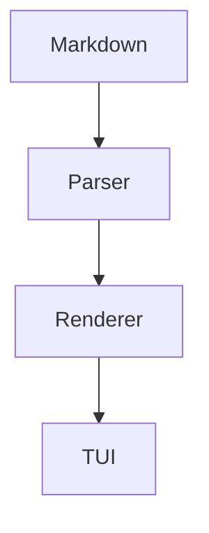

# ghmd — GitHub-style Markdown TUI browser

**ghmd** is a terminal-first Markdown browser built for long technical documents, README files, runbooks, network/DevOps notes and documentation.

It keeps the working TUI architecture from 0.4.x and expands the renderer to cover a much broader Markdown/GFM and documentation feature set.

## 0.5.0 — Extended Markdown engine

### Parser

The baseline uses `markdown-it-py`'s GFM-oriented parser. The current parser is CommonMark-compatible and pluggable; GFM tables, strikethrough, task lists, alerts and autolinks are handled by the GFM configuration, while additional syntax is supplied by `mdit-py-plugins` when available.

Enabled/attempted extensions include:

- footnotes
- front matter
- definition lists
- subscript
- superscript
- dollar math
- TeX math
- AMS math
- attributes
- admonitions
- field lists
- colon fences
- section references

The plugin loader is intentionally fault tolerant: an optional extension that is unavailable does not prevent the core reader from starting.

### Inline and block rendering

- H1–H6 visual hierarchy — Markdown `#` markers are not printed
- paragraphs and hard/soft line breaks
- bold / italic / nested emphasis
- strikethrough
- inline code
- highlight: `==text==`
- insertion: `++text++`
- subscript: `H~2~O`
- superscript: `29^th^`
- inline and block math
- emoji and Rich emoji shortcodes
- Rich CLI markup compatibility
- links, reference links and autolinks
- OSC-8 clickable links when the terminal supports them
- images, including local and remote images
- inline HTML and common semantic tags
- HTML entities
- HTML comments are ignored

### Block features

- GitHub/GFM tables
- table alignment
- task lists
- GitHub alerts: NOTE / TIP / IMPORTANT / WARNING / CAUTION
- nested ordered and unordered lists
- blockquotes and nested structures
- fenced code blocks
- indented code blocks
- syntax highlighting via Pygments / Rich
- horizontal rules
- footnotes
- definition lists
- `<details>` / `<summary>` using Textual `Collapsible`
- YAML front matter
- Mermaid flowchart fences
- math fences / dollar math
- long-document scrolling

### TUI features

- real `VerticalScroll` document viewport
- mouse wheel scrolling
- arrow keys
- `j` / `k`
- `Space` / `b`
- `Home` / `End`
- `g` / `G`
- TOC navigation
- full-document search
- `n` / `N` next/previous match
- live reload
- dark/light theme
- responsive layout
- optional terminal-native images
- chafa fallback

## Install — Ubuntu / Kali

```bash
cd ~
pipx uninstall ghmd 2>/dev/null || true
rm -rf ~/ghmd
unzip ~/ghmd-tui-0.5.0.zip
cd ~/ghmd
chmod +x install.sh
./install.sh
```

Verify:

```bash
ghmd --version
ghmd --diagnose
```

Run the quick smoke test:

```bash
ghmd examples/github-features.md
```

Run the complete A-to-Z reference:

```bash
ghmd examples/markdown-a2z.md
```

## Termux / Android

The core application is pure Python/Textual and does not require native image support. The installer detects Termux and creates a local virtual environment.

```bash
pkg update
pkg install python
cd ~/ghmd
chmod +x install.sh
./install.sh
```

Then:

```bash
ghmd examples/markdown-a2z.md --image-mode off
```

Image support is terminal-dependent. If `chafa` is available in your Termux environment, `--image-mode chafa` can be used; otherwise the core reader, search, TOC, scrolling, tables, code, alerts, math, Mermaid text diagrams and details remain usable.

## Mermaid

Common flowcharts are rendered directly in the terminal without requiring Node.js or Mermaid CLI:

````markdown

````

For complex Mermaid diagrams that ghmd cannot structurally draw, the source is displayed in a readable diagram panel instead of being discarded.

## Math

Terminal environments do not have a universal TeX typesetting protocol. ghmd therefore uses a terminal-native math fallback: common LaTeX operators and superscripts/subscripts are converted to Unicode while unknown TeX commands remain readable.

Examples:

```markdown
Inline: $E = mc^2$

$$
\\int_0^\\infty e^{-x} dx = 1
$$
```

This is intentionally a graceful terminal representation, not a claim to reproduce KaTeX/MathJax pixel-for-pixel. Unsupported TeX is preserved as readable source text rather than crashing the reader.

## Rich CLI compatibility

Rich markup is not Markdown, but ghmd can display Rich-oriented Markdown demos too.

```text
[bold red]ERROR[/bold red]
[bold green]:white_check_mark: SUCCESS[/bold green]
[bold cyan]INFO[/bold cyan]
```

Automatic detection is enabled. Force it with:

```bash
ghmd file.md --rich-markup
```

Disable it with:

```bash
ghmd file.md --no-rich-markup
```

Normal Markdown links such as `[GitHub](https://github.com)` are not treated as Rich markup.

## Keyboard controls

| Key | Action |
|---|---|
| `↑` / `↓` | Scroll |
| `j` / `k` | Scroll down/up |
| `Space` | Page down |
| `b` | Page up |
| `g` | Top |
| `G` | Bottom |
| `Home` / `End` | Top/bottom |
| `t` | TOC |
| `/` | Search |
| `n` / `N` | Next/previous match |
| `r` | Reload |
| `w` | Toggle live reload |
| `c` | Copy readable rendered document text |
| `C` | Copy original Markdown source |
| `Ctrl+C` | Copy selected text (Textual selection) |
| `Esc` | Close overlay / quit |
| `q` | Quit |

## Image modes

```bash
ghmd README.md --image-mode auto
ghmd README.md --image-mode native
ghmd README.md --image-mode chafa
ghmd README.md --image-mode off
```

Remote images are cached under `~/.cache/ghmd/images/`.

Ubuntu fallback:

```bash
sudo apt update
sudo apt install -y chafa
```

## Test / development

```bash
python3 -m compileall ghmd
python3 -m pytest
```

Interactive terminal behavior should also be tested in the target terminal emulator because graphics protocols vary between terminals.

## Reference

The included `examples/markdown-a2z.md` is based on the supplied A-to-Z Markdown reference and expanded with GFM alerts, task lists, Rich markup, Mermaid, math, front matter and terminal-specific cases.

## License

MIT
