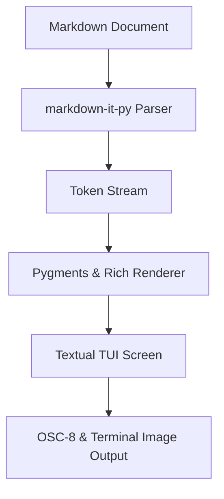
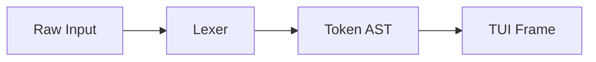
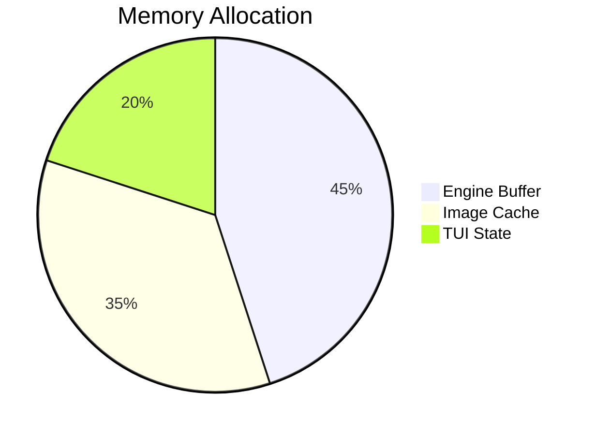
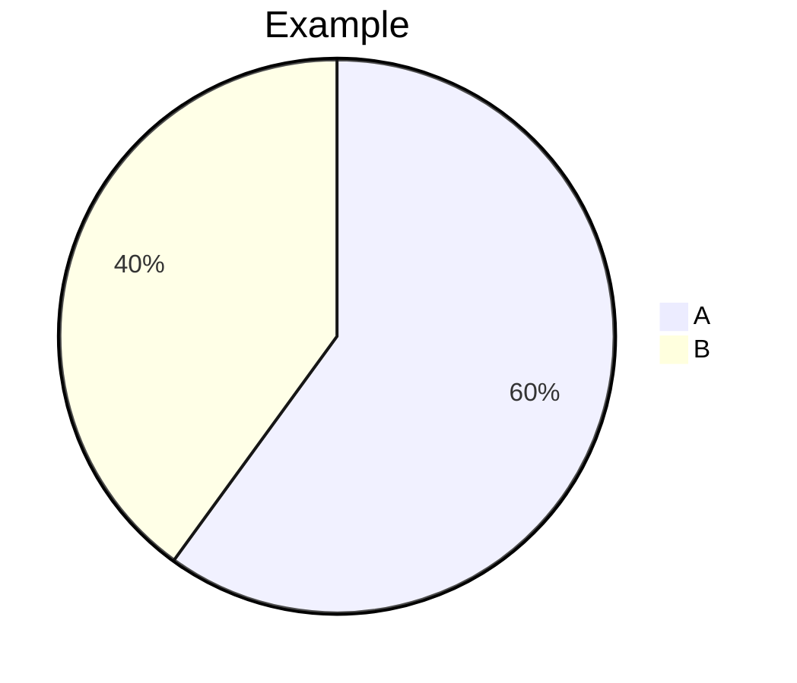
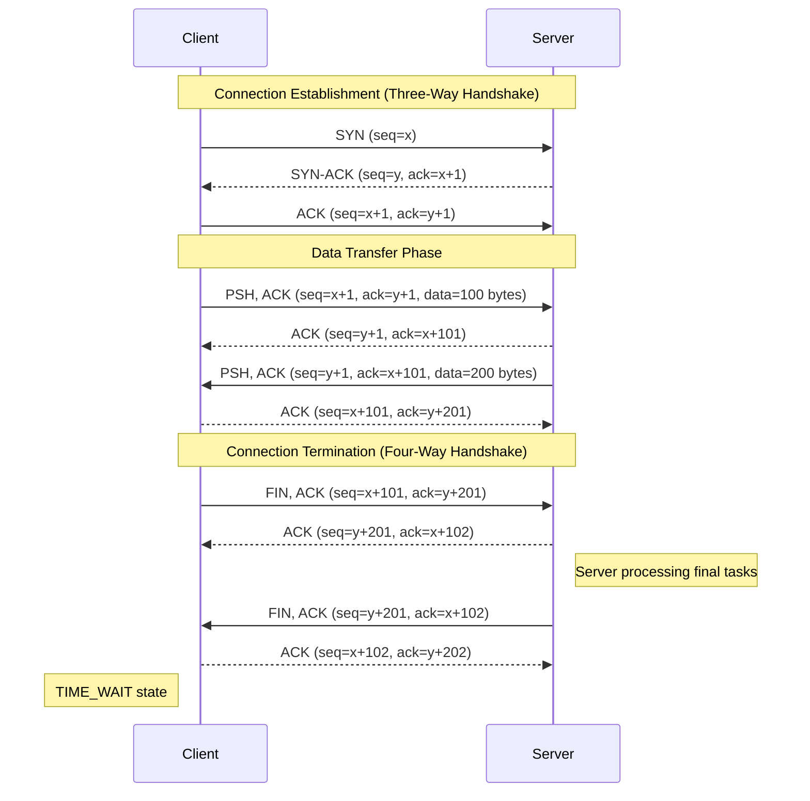
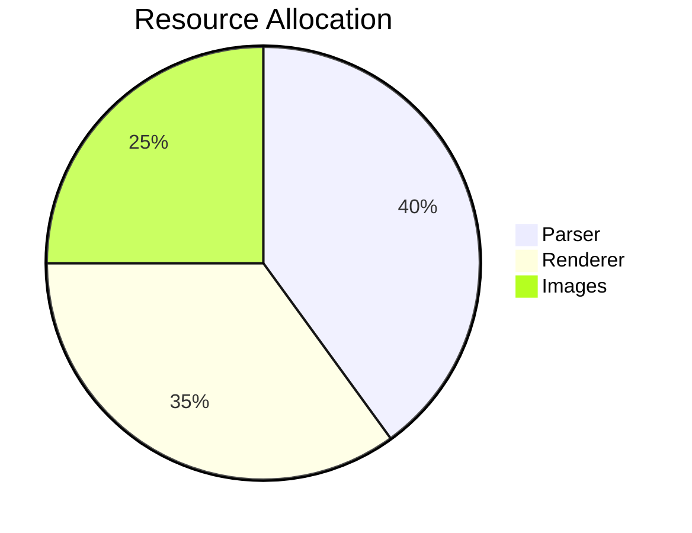

# ghmd Comprehensive Test Suite

This document tests all parsing, inline/block rendering, GFM extensions, terminal graphics, Rich markup, and interactive TUI elements in `ghmd`.

---

# 1. Typography & Inline Formatting

Standard paragraph testing regular flow text. **Bold text**, __alternative bold__, *italic text*, _alternative italic_, and ***bold italic text***.

- **Strikethrough:** ~~Deprecated functionality~~
- **Highlight (Pandoc/Extension):** ==Crucial diagnostic highlight==
- **Insertion:** ++Newly deployed line++
- **Subscript & Superscript (Markdown):** H~2~O, CO~2~, 29^th^ edition, and E = mc^2^
- **Combined Inlines:** **Bold text containing `inline code`, _nested italic_, and a [Markdown Link](https://github.com)**
- **Edge cases:** un*frigging*believable, a\_b\_c, \*\*escaped asterisks\*\*, and \# not a heading

---

# 2. Semantic Inline HTML & Entities

Testing raw inline HTML tags and entity translation:

- **HTML Styling:** <b>Bold tag</b>, <i>Italic tag</i>, <u>Underline tag</u>, <mark>Marked text</mark>, and <del>Deleted tag</del>
- **Keys & Scripts:** Press <kbd>Ctrl</kbd> + <kbd>Alt</kbd> + <kbd>T</kbd> | H<sub>2</sub>O and X<sup>2</sup>
- **Line Break:** First line using `<br>` tag<br>Second line directly below
- **HTML Entities:** &copy; 2026 | AT&amp;T | 100 &lt; 200 | &gt; quote symbol | &quot;Double quotes&quot; | &euro; 50
- **Comments (Should be completely hidden):** <!-- Hidden internal parser comment -->

---

# 3. Headings (ATX & Setext)

# Heading Level 1
## Heading Level 2
### Heading Level 3
#### Heading Level 4
##### Heading Level 5
###### Heading Level 6

Setext H1
=========

Setext H2
---------

---

# 4. Links & Autolinks

- **Standard Inline Link:** [GitHub Official](https://github.com "GitHub Homepage")
- **Reference-style Link:** [Kernel Archives][kernel-ref]
- **Direct Autolinks:** <https://www.kernel.org> and <contact@example.com>
- **Autolink Literals (GFM):** https://1.1.1.1 and www.github.com

[kernel-ref]: https://www.kernel.org

---

# 5. Image Protocol Testing

### Remote Image (HTTPS)


### Local Image 1


### Local Image 2 (Reference Style)
![Siva Local PNG][siva-local]

[siva-local]: /home/kali/siva.png "Local Image 2 - Siva"

---

# 6. GFM Callouts / Alerts

> [!NOTE]
> Standard informational notice for general operational guidance.

> [!TIP]
> Useful suggestion to optimize terminal graphics with `--image-mode chafa`.

> [!IMPORTANT]
> Critical architectural requirement: verify terminal protocol capabilities before full-screen rendering.

> [!WARNING]
> High resource utilization or invalid syntax may trigger fallback render blocks.

> [!CAUTION]
> Direct manipulation of pipeline buffers can lead to unexpected frame drops.

---

# 7. Tables & Cell Alignments

| Service Name | Port | Protocol | Status | Notes |
| :--- | :---: | :---: | ---: | :--- |
| **BGP Daemon** | 179 | TCP | `Active` | Core routing convergence |
| **Telemetry (gNMI)** | 57400 | gRPC | `Active` | Streaming sensor data |
| **Syslog Relay** | 514 | UDP | `Standby` | Edge log collector |
| **Uptime Kuma** | 3001 | HTTP | `Active` | Internal reachability check |

---

# 8. Task Lists

- [x] Integrate CommonMark tokenizer
- [x] Implement GFM Alert callouts (NOTE, TIP, IMPORTANT, WARNING, CAUTION)
- [x] Configure Sixel/Kitty/Chafa image pipelines
- [ ] Implement live terminal buffer reflow
- [ ] Add OSC-52 clipboard integration

---

# 9. Blockquotes & Nested Structures

> Top-level blockquote detailing core interface specifications.
>
> > Nested blockquote level 2: Layer 3 interface IP configurations.
> > > Nested blockquote level 3: `10.255.0.1/32` loopback address configured.
>
> - List item inside blockquote
> - Second nested item with `monospace` token

---

# 10. Code Blocks & Syntax Highlighting

### Indented Code Block (4 Spaces)

    #!/usr/bin/env bash
    echo "Testing indented code block rendering"

### Fenced Python Block

```python
from dataclasses import dataclass
from typing import List

@dataclass
class NetworkNode:
    hostname: str
    asn: int
    loopback_ip: str
    active: bool = True

    def summary(self) -> str:
        return f"{self.hostname} (AS{self.asn}) - {self.loopback_ip}"

nodes: List[NetworkNode] = [
    NetworkNode("core-pe-01", 65001, "10.0.0.1"),
    NetworkNode("edge-asbr-02", 65002, "10.0.0.2"),
]

for node in nodes:
    print(node.summary())
```

### Fenced JSON Block

```json
{
  "device": "router-core-01",
  "interfaces": [
    { "name": "HundredGigE0/0/0/0", "enabled": true, "speed": 100000 },
    { "name": "HundredGigE0/0/0/1", "enabled": false, "speed": 100000 }
  ]
}
```

---

# 11. Mathematics ($inline$ & $$block$$)

* **Inline Math:** Energy equation is defined by $E = mc^2$, and the Pythagorean theorem states $a^2 + b^2 = c^2$.
* **Euler's Identity:** $e^{i\pi} + 1 = 0$

### Standalone Display Equations

$$\int_{0}^{\infty} e^{-x^2} dx = \frac{\sqrt{\pi}}{2}$$

$$\sum_{k=1}^{n} k^3 = \left( \frac{n(n+1)}{2} \right)^2$$

$$\mathbf{A} \mathbf{x} = \lambda \mathbf{x} \quad \Longleftrightarrow \quad \det(\mathbf{A} - \lambda \mathbf{I}) = 0$$

---

# 12. Diagrams (Mermaid)

### Flowchart: Top-Down (`graph TD`)



### Flowchart: Left-to-Right (`graph LR`)



### Fallback Diagram Test



---

# 13. Rich CLI Markup Compatibility

[bold red]CRITICAL: Pipeline alert encountered[/bold red]

[bold green]:heavy_check_mark: Health check passed successfully[/bold green]

[bold cyan]:information_source: Telemetry stream synchronized[/bold cyan]

[bold italic underline yellow]Combined Style: Terminal Output Format Verification[/bold italic underline yellow]

---

# 14. Collapsible Sections (`<details>`)

<details>
<summary>Click to expand</summary>

```text
[2026-08-27 17:57:20] INFO: Initializing ghmd reader instance...
[2026-08-27 17:57:20] DEBUG: Image backend resolved to native/chafa
[2026-08-27 17:57:21] INFO: Render pass complete. 0 errors, 0 warnings.
```

</details>

---

# 15. Definition Lists & Footnotes

Markdown
: A lightweight markup language designed for readability and plain-text authoring.

GFM
: GitHub Flavored Markdown specification adding tables, task lists, and alerts.

TUI
: Terminal User Interface leveraging terminal grids for structured visual applications.

Here is a statement requiring citation verification.[^first-note] Another section referencing performance parameters.[^second-note]

[^first-note]: Markdown parser implementation leverages `markdown-it-py` and `mdit-py-plugins`.
[^second-note]: Test completed on x86_64 Ubuntu / Kali Linux environment.

---

# 16. Advanced Fallback Coverage

### TeX bracket math

\(\alpha + \beta = \gamma\)

\[\frac{a}{b} = \sqrt{x}\]

### Matrix

$$
\begin{pmatrix}
a & b \\
c & d
\end{pmatrix}
$$

### Additional code languages

```bash
echo "bash"
```

```java
class Hello { public static void main(String[] args) { System.out.println("Hello"); } }
```

```javascript
const ghmd = "Markdown TUI";
console.log(ghmd);
```

```yaml
service:
  name: ghmd
  enabled: true
```

```sql
SELECT service, port FROM network_services WHERE status = 'Active';
```

### Unsupported Mermaid safely falls back



---

# 16. Mermaid Sequence Diagram



---

# 17. Advanced Mathematics

Inline: $\alpha + \beta = \gamma$, $e^{i\pi}+1=0$, and $H_2O$ using normal Markdown subscript syntax.

### Fractions and roots

$$\frac{a+b}{c+d} = \frac{\sqrt{x}}{2}$$

$$\frac{1}{1 + \frac{1}{x}}$$

### Integrals and limits

$$\int_{0}^{\infty} e^{-x^2}\,dx = \frac{\sqrt{\pi}}{2}$$

$$\lim_{x\to\infty} \frac{1}{x} = 0$$

### Summation and products

$$\sum_{k=1}^{n} k^3 = \left(\frac{n(n+1)}{2}\right)^2$$

$$\prod_{i=1}^{n} i = n!$$

### Greek letters and operators

$$\alpha + \beta + \gamma + \Delta + \Omega \in \mathbb{R}$$

### Matrix

$$\begin{pmatrix} 1 & 2 \\\\ 3 & 4 \end{pmatrix}$$

---

# 18. HTML Details / Collapsible Content

<details>
<summary>Click to expand advanced Markdown notes</summary>

This content is hidden until the section is expanded.

- Markdown remains readable.
- The TUI keeps the section interactive.
- Unsupported HTML is safely reduced to readable text.

</details>

---

# 19. Mermaid Unsupported-Syntax Fallback



If a Mermaid construct is not supported by the native terminal renderer, ghmd preserves the source instead of crashing or silently deleting it.

---

# 51. 🧭 WHAT THIS FILE COVERS

| Area | Covered here? |
|---|:---:|
| 4-bit / ANSI colors | ✅ |
| Bright colors | ✅ |
| 256-color names | ✅ |
| Hex / RGB colors | ✅ |
| Background colors | ✅ |
| Bold | ✅ |
| Dim | ✅ |
| Italic | ✅ |
| Underline | ✅ |
| Strike | ✅ |
| Reverse | ✅ |
| Blink | ✅ |
| Combined styles | ✅ |
| Nested markup | ✅ |
| Emoji | ✅ |
| Emoji codes | ✅ |
| Emoji styles | ✅ |
| Markdown headings | ✅ |
| Bold Markdown | ✅ |
| Italic Markdown | ✅ |
| Strikethrough | ✅ |
| Inline code | ✅ |
| Links | ✅ |
| Block quotes | ✅ |
| Lists | ✅ |
| Nested lists | ✅ |
| Ordered lists | ✅ |
| Tables | ✅ |
| Table alignment | ✅ |
| Fenced code | ✅ |
| Python highlighting | ✅ |
| Bash highlighting | ✅ |
| JSON highlighting | ✅ |
| JavaScript highlighting | ✅ |
| TypeScript highlighting | ✅ |
| Rust highlighting | ✅ |
| SQL highlighting | ✅ |
| YAML highlighting | ✅ |
| HTML highlighting | ✅ |
| Images | ⚠️ terminal-dependent |
| CLI alignment | ✅ commands included |
| Width | ✅ commands included |
| Wrapping | ✅ commands included |
| Line numbers | ✅ commands included |
| Indentation guides | ✅ commands included |
| Themes | ✅ commands included |
| Lexer override | ✅ commands included |
| Hyperlinks | ✅ commands included |
| JSON mode | ✅ commands included |
| CSV / TSV | ✅ commands included |
| Pager | ✅ commands included |
| URL input | ✅ commands included |
| STDIN | ✅ commands included |
| Rules | ✅ commands included |
| Panels | ⚠️ Python / CLI |
| Progress | ⚠️ dynamic / Python |
| Live display | ⚠️ Python |
| Logging | ⚠️ Python |
| Tracebacks | ⚠️ Python |
| Pretty printing | ⚠️ Python |
| Object inspection | ⚠️ Python |
| Trees / layouts | ⚠️ Python |

## 52. Rich RGB / Hex and Nested List Regression Tests

[red]RED[/red]  [green]GREEN[/green]  [blue]BLUE[/blue]

[#ff0000]HEX RED[/#ff0000]  [#00ff00]HEX GREEN[/#00ff00]  [#0088ff]HEX BLUE[/#0088ff]

[white on red]WHITE ON RED[/white on red]

[bold #ff00ff]BOLD MAGENTA[/bold #ff00ff]

- Level 1
  - Level 2
    - Level 3
      - Level 4
  - Another Level 2
- Another top-level item

## 53. Math Regression Tests

Inline: $\alpha + \beta = \gamma$, $e^{i\pi}+1=0$, and $H_2O$.

$$\frac{a+b}{c+d}=\frac{\sqrt{x}}{2}$$

$$\int_{0}^{\infty} e^{-x^2}\,dx = \frac{\sqrt{\pi}}{2}$$

$$\lim_{x\to\infty}\frac{1}{x}=0$$

$$\sum_{k=1}^{n} k^3 = \left(\frac{n(n+1)}{2}\right)^2$$

$$\prod_{i=1}^{n} i=n!$$

$$\alpha+\beta+\gamma+\Delta+\Omega\in\mathbb{R}$$

$$\begin{pmatrix}1&2\\3&4\end{pmatrix}$$

## 54. Mermaid Sequence Regression Test


