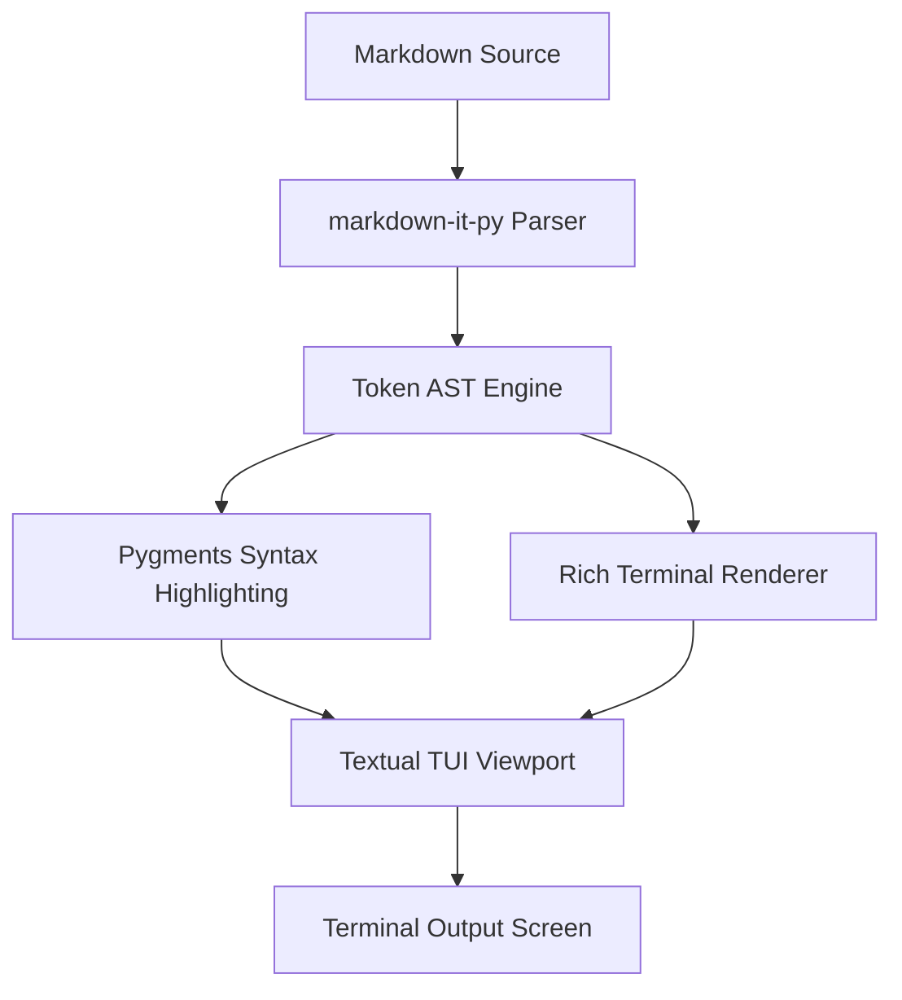
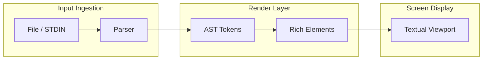
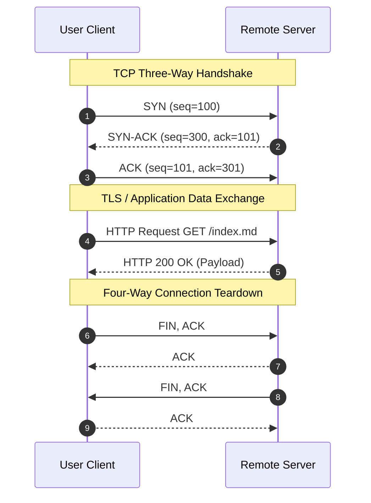
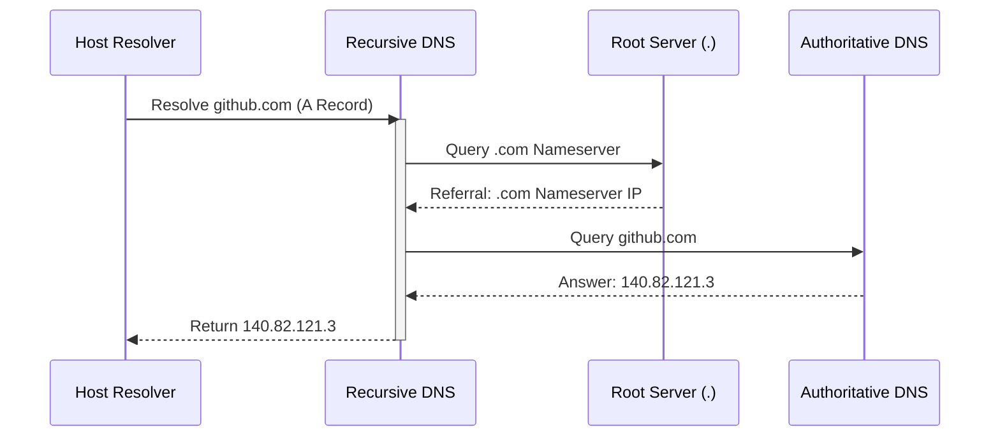
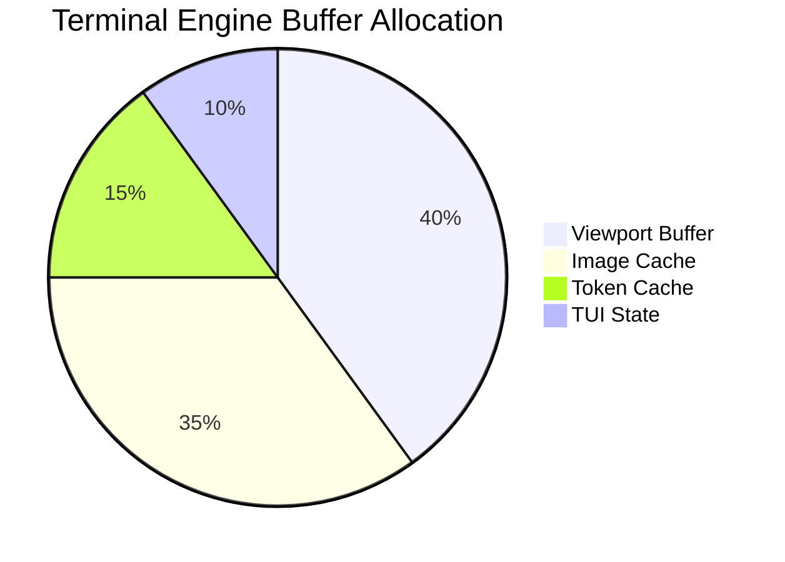

```text
title: ghmd Full Feature Suite & Test Benchmark
author: Sherif
date: 2026-08-27
version: 0.5.3
tags: [markdown, gfm, tui, test-suite, terminal, rich]
description: Complete functional benchmark file covering every GFM, CommonMark, Rich CLI, ANSI, Math, Mermaid, Code, Image, and TUI feature in ghmd.
```

# ghmd 0.5.3 Comprehensive Reference & Test Suite

This document tests all parsing, inline/block rendering, GFM extensions, terminal graphics, Rich markup, ANSI styles, and interactive TUI elements in `ghmd`.

---

# 1. Typography & Inline Formatting

Standard paragraph testing regular flow text. **Bold text**, __alternative bold__, *italic text*, _alternative italic_, and ***bold italic text***.

- **Strikethrough (GFM):** ~~Deprecated functionality~~
- **Highlight (Pandoc/Extension):** ==Crucial diagnostic highlight==
- **Insertion:** ++Newly deployed line++
- **Subscript & Superscript (Markdown):** H~2~O, CO~2~, 29^th^ edition, and E = mc^2^
- **Underline & Semantic Tags:** <u>Underlined text</u>, <ins>Inserted tag</ins>, <mark>Marked text</mark>, and <del>Deleted tag</del>
- **Keys & Monospace:** Press <kbd>Ctrl</kbd> + <kbd>Alt</kbd> + <kbd>T</kbd> to launch terminal; inline code: `ghmd --diagnose`
- **Combined Inlines:** **Bold text containing `inline code`, _nested italic_, and a [Markdown Link](https://github.com)**
- **Edge cases & Escapes:** un*frigging*believable, a\_b\_c, \*literal asterisks\*, \# not a heading, \[not a link\], and \`not code\`

---

# 2. Rich CLI & Terminal Color Markup

### Standard ANSI & Bright Colors
[red]Red[/red] | [green]Green[/green] | [blue]Blue[/blue] | [yellow]Yellow[/yellow] | [magenta]Magenta[/magenta] | [cyan]Cyan[/cyan] | [white]White[/white]
[bright_red]Bright Red[/bright_red] | [bright_green]Bright Green[/bright_green] | [bright_blue]Bright Blue[/bright_blue] | [bright_yellow]Bright Yellow[/bright_yellow] | [bright_cyan]Bright Cyan[/bright_cyan]

### 256-Color Names & RGB / Hex Codes
[deep_sky_blue1]Deep Sky Blue 1 (256-color)[/deep_sky_blue1] | [orange3]Orange 3 (256-color)[/orange3] | [spring_green1]Spring Green 1[/spring_green1]
[#ff0000]HEX #FF0000[/#ff0000] | [#00ff88]HEX #00FF88[/#00ff88] | [#5f00d7]HEX #5F00D7[/#5f00d7] | [rgb(255,105,180)]RGB(255,105,180) Pink[/rgb(255,105,180)]

### Text Attributes & Background Colors
- [bold]Bold Text[/bold]
- [dim]Dim / Faint Text[/dim]
- [italic]Italic Text[/italic]
- [underline]Underline Text[/underline]
- [strike]Strike Text[/strike]
- [reverse]Reverse / Inverted Text[/reverse]
- [blink]Blink Text (Terminal dependent)[/blink]
- [white on red] WHITE ON RED BACKGROUND [/white on red]
- [black on #00ff00] BLACK ON HEX GREEN BACKGROUND [/black on #00ff00]
- [bold italic underline #ffff00 on #000088] COMBINED COMPLEX RICH STYLE [/bold italic underline #ffff00 on #000088]

### Nested Rich Markup
[bold yellow]Yellow outer text [bold red on white] RED INNER BOX [/bold red on white] Back to yellow[/bold yellow]

### Emoji & Shortcodes
- Unicode Emoji: 🚀 ⚡ 🔥 💻 🌐 📦 ✅ ⚠️ 🛑
- Rich Emoji Codes: :rocket: :fire: :heavy_check_mark: :information_source: :warning: :computer: :package:

---

# 3. Headings (ATX & Setext)

# ATX Heading Level 1
## ATX Heading Level 2
### ATX Heading Level 3
#### ATX Heading Level 4
##### ATX Heading Level 5
###### ATX Heading Level 6

Setext Heading Level 1
======================

Setext Heading Level 2
----------------------

---

# 4. Links & Autolinks

- **Standard Inline Link:** [GitHub Official](https://github.com "GitHub Homepage")
- **Reference-style Link:** [Kernel Archives][kernel-ref]
- **Direct Autolinks:** <https://www.kernel.org> and <sherif@example.com>
- **Autolink Literals (GFM):** https://1.1.1.1, http://localhost:8000, and www.github.com

[kernel-ref]: https://www.kernel.org

---

# 5. Image Protocol & Cache Testing

### Remote HTTPS Image (Cache Pipeline)


### Local Image 1 (Kitty / WezTerm / Chafa Protocol)


### Local Image 2 (Reference Style Local Image)
![Siva Local PNG][siva-local]

[siva-local]: /home/kali/siva.png "Local Image 2 - Siva"

---

# 6. GFM Alerts & Callouts

> [!NOTE]
> Informational notice highlighting baseline environment requirements and defaults.

> [!TIP]
> Use `--image-mode chafa` on low-overhead terminals or Termux for maximum compatibility.

> [!IMPORTANT]
> Verify terminal emulator graphics protocol capabilities (Kitty, Sixel, or iTerm2) prior to launching native image rendering.

> [!WARNING]
> Live reload watching large directory trees with excessive file events may introduce render latency.

> [!CAUTION]
> Direct memory allocation manipulations inside shader pipelines may cause canvas tearing.

---

# 7. Lists & Task Lists

### Bullet & Unordered Lists
* Asterisk bullet item
+ Plus marker item
- Standard dash item
  - Indented level 2 bullet
    - Deep level 3 bullet
      - Deep level 4 bullet

### Ordered Lists
1. First deployment sequence
2. Second initialization step
   1. Sub-step A
   2. Sub-step B
3. Final convergence check

### Mixed Lists
1. Ingress route validation
   - Verify BGP session state
   - Confirm routing policy application
2. Egress packet filtering
   - Check ACL table entries

### GFM Task Lists
- [x] Integrate CommonMark compliant token lexer
- [x] Support full ANSI, RGB, and Rich markup color palette
- [x] Configure image backend pipelines (Native Kitty, WezTerm, Chafa)
- [ ] Add OSC-52 terminal clipboard integration
- [ ] Implement multi-pane horizontal split view

---

# 8. Tables (Alignment & Inline Formatting)

| Service Name | Port | Transport | Metric Status | Rich Status | Inlines |
| :--- | :---: | :---: | ---: | :---: | :--- |
| **BGP Daemon** | 179 | TCP | `ACTIVE` | [bold green]ONLINE[/bold green] | *Primary routing* |
| **Telemetry (gNMI)** | 57400 | gRPC | `ACTIVE` | [bold cyan]SYNCED[/bold cyan] | **Real-time push** |
| **Syslog Relay** | 514 | UDP | `STANDBY` | [yellow]IDLE[/yellow] | ~~Legacy port~~ |
| **NetFlow Exporter** | 2055 | UDP | `ACTIVE` | [bold green]ONLINE[/bold green] | Flow sampling |
| **Uptime Kuma** | 3001 | HTTP | `ACTIVE` | [bold #00ff88]HEALTHY[/bold #00ff88] | ==Monitored== |

---

# 9. Blockquotes & Nested Quotes

> Primary blockquote level 1 covering global architecture specifications.
>
> > Nested blockquote level 2: BGP autonomous system routing boundary details.
> > > Nested blockquote level 3: Loopback interface bound to `10.255.0.1/32`.
>
> - List item embedded directly within a blockquote
> - [bold cyan]Rich markup embedded inside blockquote[/bold cyan]
> - `inline code` and [Markdown Link](https://example.com) inside blockquote

---

# 10. Code Blocks & Syntax Highlighting

### Indented Code Block (4 Spaces)

    #!/usr/bin/env bash
    # Indented code block test
    echo "Running system pre-flight diagnostics..."

### Bash / Shell

```bash
#!/usr/bin/env bash
set -euo pipefail
echo -e "\033[1;32m[+] Starting ghmd validation\033[0m"
ghmd examples/ghmd-demo.md --rich-markup

```

### Python

```python
from dataclasses import dataclass
from typing import List

@dataclass
class RouteEntry:
    prefix: str
    next_hop: str
    asn: int
    local_pref: int = 100

routes: List[RouteEntry] = [
    RouteEntry("10.0.0.0/24", "192.168.1.1", 65001),
    RouteEntry("172.16.0.0/16", "192.168.1.254", 65002, 200),
]

active_routes = [r for r in routes if r.local_pref >= 100]
print(f"Active converged routes: {len(active_routes)}")

```

### Java

```java
public class RouteEngine {
    public static void main(String[] args) {
        System.out.println("BGP Convergence Engine Initialized.");
    }
}

```

### JavaScript

```javascript
const routeTable = new Map([
  ["10.0.0.0/24", { nextHop: "192.168.1.1", metric: 10 }],
  ["172.16.0.0/16", { nextHop: "192.168.1.254", metric: 20 }]
]);
console.log(`Prefix count: ${routeTable.size}`);

```

### TypeScript

```typescript
interface PeerSession {
  remoteAsn: number;
  peerIp: string;
  uptimeSeconds: number;
  established: boolean;
}

const session: PeerSession = {
  remoteAsn: 65001,
  peerIp: "10.1.1.1",
  uptimeSeconds: 86400,
  established: true
};

```

### C / C++

```cpp
#include <iostream>
#include <vector>

int main() {
    std::vector<int> interfaces = {0, 1, 2, 3};
    std::cout << "Discovered " << interfaces.size() << " network interfaces.\n";
    return 0;
}

```

### C#

```csharp
using System;

public class Program {
    public static void Main() {
        Console.WriteLine("ghmd TUI C# Syntax Highlighting Test");
    }
}

```

### Go

```go
package main

import "fmt"

func main() {
    status := map[string]string{"eth0": "UP", "eth1": "DOWN"}
    fmt.Printf("Interface status: %v\n", status)
}

```

### Rust

```rust
fn main() {
    let interfaces: Vec<&str> = vec!["eth0", "eth1", "lo"];
    for iface in &interfaces {
        println!("Polling telemetry for interface: {}", iface);
    }
}

```

### Kotlin

```kotlin
fun main() {
    val nodeHealth = listOf("core-01" to true, "edge-02" to false)
    nodeHealth.forEach { (node, healthy) -> println("$node: healthy=$healthy") }
}

```

### Ruby

```ruby
class ServiceMesh
  def initialize(nodes)
    @nodes = nodes
  end
  def deploy
    puts "Deploying to #{@nodes.join(', ')}"
  end
end
ServiceMesh.new(["node-1", "node-2"]).deploy

```

### PHP

```php
<?php
$telemetry = ["cpu" => 12.5, "memory" => 64.2, "status" => "nominal"];
echo json_encode($telemetry);

```

### PowerShell

```powershell
Get-Service | Where-Object { $_.Status -eq "Running" } | Select-Object -First 5

```

### SQL

```sql
SELECT service_name, port, protocol, status
FROM network_registry
WHERE status = 'Active'
ORDER BY port ASC;

```

### JSON

```json
{
  "hostname": "core-router-01",
  "as_number": 65001,
  "interfaces": [
    { "id": "HundredGigE0/0/0/0", "status": "up", "speed_gbps": 100 }
  ]
}

```

### YAML

```yaml
version: "3.8"
services:
  ghmd-browser:
    image: ghmd:0.5.3
    restart: unless-stopped
    environment:
      - TERM=xterm-256color

```

### HTML / XML

```xml
<configuration version="1.0">
  <router id="core-pe-01">
    <bgp asn="65001" status="enabled"/>
  </router>
</configuration>

```

### Dockerfile

```dockerfile
FROM python:3.13-slim
WORKDIR /app
COPY requirements.txt .
RUN pip install --no-cache-dir -r requirements.txt
COPY . .
ENTRYPOINT ["ghmd"]

```

---

# 11. Mathematics ($inline$ &

$$display$$

)

* **Inline Equations:** The mass-energy equivalence is $E = mc^2$, the Pythagorean theorem is $a^2 + b^2 = c^2$, and the standard circle relation is $x^2 + y^2 = r^2$.
* **TeX Bracket Inline:** $\alpha + \beta = \gamma$
* **Euler's Identity:** $e^{i\pi} + 1 = 0$

### Fractions and Roots

$$\frac{a + b}{c + d} = \frac{\sqrt{x^2 + y^2}}{2\pi}$$

$$\frac{1}{1 + \frac{1}{1 + \frac{1}{x}}}$$

### Integrals and Limits

$$\int_{0}^{\infty} e^{-x^2} dx = \frac{\sqrt{\pi}}{2}$$

$$\lim_{x \to \infty} \left( 1 + \frac{1}{x} \right)^x = e$$

### Summations and Products

$$\sum_{k=1}^{n} k^3 = \left( \frac{n(n+1)}{2} \right)^2$$

$$\prod_{i=1}^{n} i = n!$$

### Greek Letters & Standard Operators

$$\alpha + \beta + \gamma + \delta + \epsilon \le \Delta + \Omega \in \mathbb{R}$$

$$\mathbf{A} \mathbf{x} = \lambda \mathbf{x} \quad \Longleftrightarrow \quad \det(\mathbf{A} - \lambda \mathbf{I}) = 0$$

### Matrices and Binomials

$$\begin{pmatrix} a & b & c \\ d & e & f \\ g & h & i \end{pmatrix} \begin{pmatrix} x \\ y \\ z \end{pmatrix} = \begin{pmatrix} 0 \\ 0 \\ 0 \end{pmatrix}$$

$$\binom{n}{k} = \frac{n!}{k!(n-k)!}$$

---

# 12. Diagrams (Mermaid)

### Flowchart: Top-Down (`graph TD`)



### Flowchart: Left-to-Right (`graph LR` with Subgraph Groups)



### Sequence Diagram: Three-Way Handshake & Teardown



### Sequence Diagram: Recursive DNS Resolution



### Safe Fallback for Unsupported Mermaid Syntax



---

# 13. HTML Semantic Tags, Entities & Collapsible Sections

### Inline Tags & Formatting

* Semantic tags: Raw Bold, Raw Italic, Raw Underline, Highlight Tag, Strike Tag
* Scripting & Layout: Subscript: H2O | Superscript: X2
* Break test:


Direct line break rendered via `<br>` tag.

### HTML Entities

* Ampersand: AT&T
* Comparison: 10 < 20 and 50 > 25
* Quotes & Symbols: "Quoted Text" | © 2026 | ® | € 100 | ± 5

### Interactive Collapsible `<details>` & `<summary>`

```text
[2026-08-27 20:00:01] [INFO]  Parser initialized: markdown-it-py (GFM mode)
[2026-08-27 20:00:01] [INFO]  Terminal graphics capabilities: Kitty/WezTerm/Chafa detected
[2026-08-27 20:00:02] [DEBUG] Cache store checked: ~/.cache/ghmd/images/
[2026-08-27 20:00:02] [OK]    Render loop complete: 0 warnings, 0 syntax faults.

```

* Live interactive folding supported via Textual `Collapsible`.
* Sub-item test inside details view.

* Fully CommonMark and GFM compliant.
* Safe fallbacks prevent crashes on malformed input.

---

# 14. Definition Lists, Footnotes & Abbreviations

Markdown
: A lightweight plain-text markup format created for readable structured documentation.

GFM
: GitHub Flavored Markdown adding tables, task lists, and alerts.

TUI
: Text User Interface providing interactive widget layouts within standard terminal emulators.

*[TOC]: Table of Contents
*[BGP]: Border Gateway Protocol
*[CLI]: Command Line Interface

BGP routing policy applied to edge interfaces. Use the TOC for fast navigation across the CLI manual.

Document integrity verified via automated unit test runner.[^footnote-parser] Graphics compatibility depends on host terminal protocol support.[^footnote-graphics]

[^footnote-parser]: Core parser engine powered by `markdown-it-py` and `mdit-py-plugins`.
[^footnote-graphics]: Supports Native Kitty graphics, WezTerm inline protocols, and `chafa` Sixel/character fallback.

---

# 15. TUI Interactive Features & Controls

| Shortcut Key | Action Performed | Tested Feature |
| --- | --- | --- |
| `↑` / `↓` or `j` / `k` | Single line vertical scroll | Scroll engine |
| `Space` / `b` | Page down / Page up | Page navigation |
| `g` / `G` | Jump to top / Jump to bottom | Fast buffer positioning |
| `Home` / `End` | Start / End of document | Viewport boundaries |
| `t` | Toggle Table of Contents (TOC) | Modal TOC drawer |
| `/` | Open full-text document search | Real-time pattern search |
| `n` / `N` | Next / Previous search match | Search iteration |
| `r` | Manual document reload | Reload pipeline |
| `w` | Toggle live reload file watcher | Live reload/watch |
| `c` | Copy rendered formatted text | Clipboard export |
| `y` | Copy raw source Markdown | Raw buffer extraction |
| `Mouse Wheel` | Smooth scrolling & item click | Mouse interaction |
| `Esc` / `q` | Close overlay / Exit reader | Safe TUI teardown |
