# Mermaid — GitHub-Compatible Complete Examples through #50


## Target runtime: GitHub Mermaid v11.17.2


These examples are intended for GitHub Markdown rendering with the Mermaid runtime reported by GitHub as **v11.17.2**.


---


## 1. Flowchart


### Basic


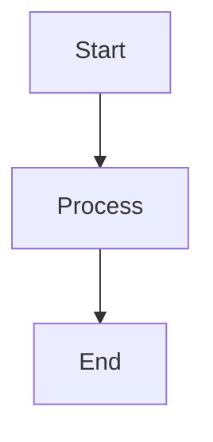


### Left → Right


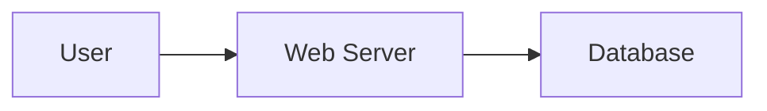


### Shapes


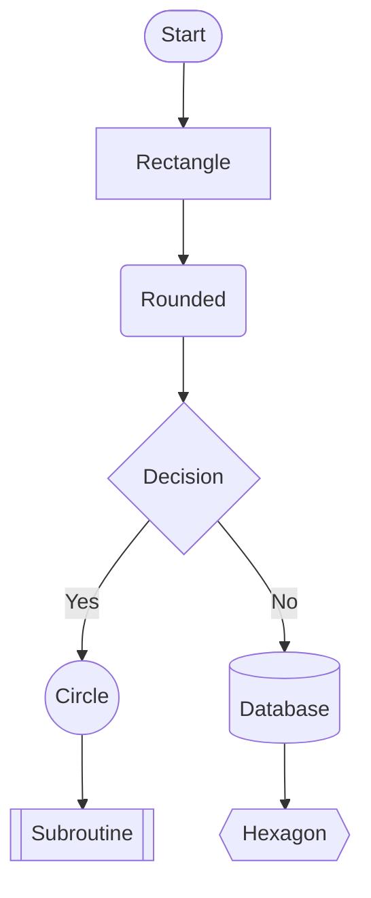


### Links and labels


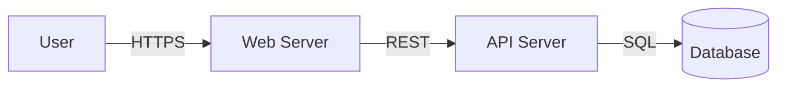


### Subgraph


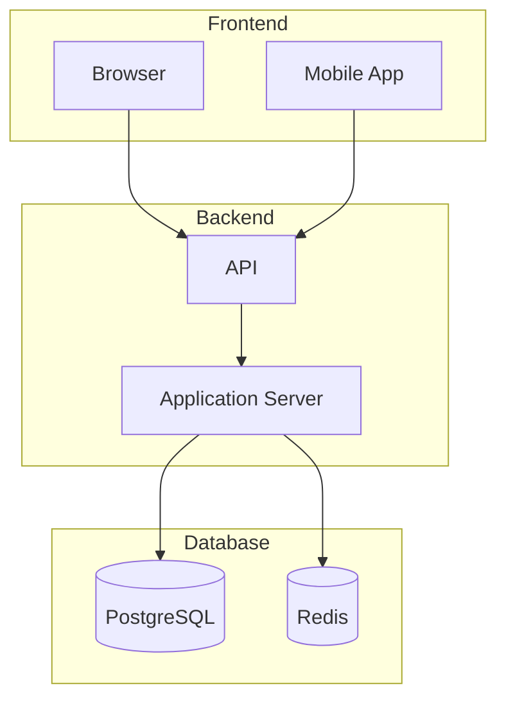


### Styling


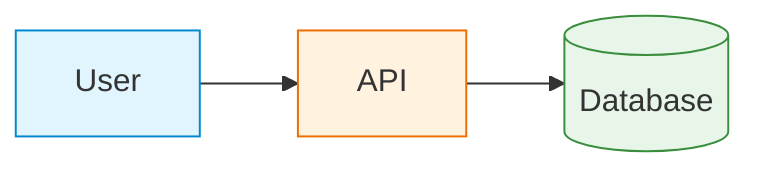


### Clickable link


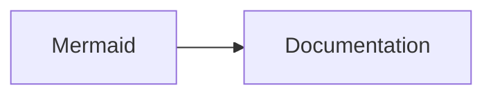


### Link styling


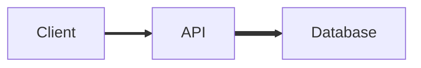


### ELK layout — GitHub-compatible alternative

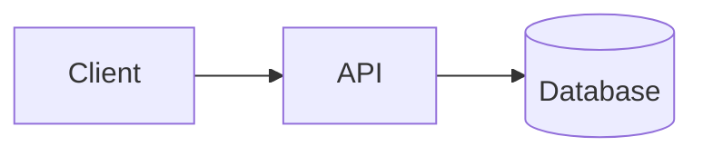

### DAG / infrastructure


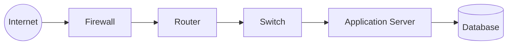


---


# 2. Swimlanes Diagram


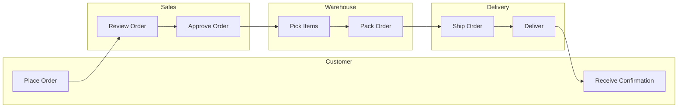


### Vertical swimlanes


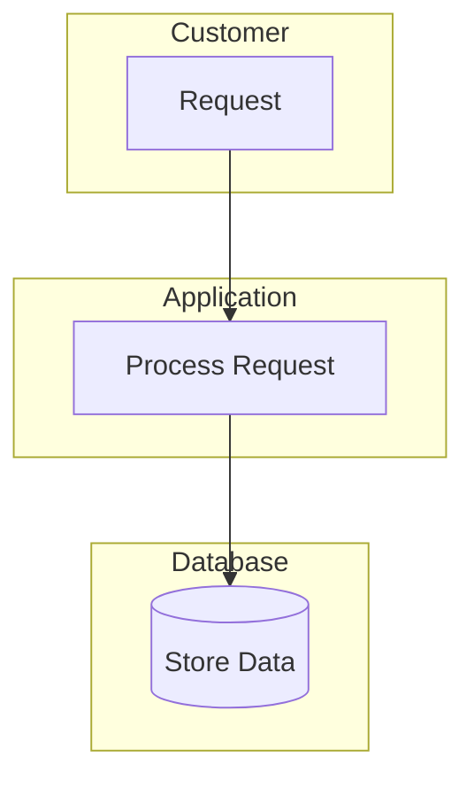


---


# 3. Sequence Diagram


### Basic


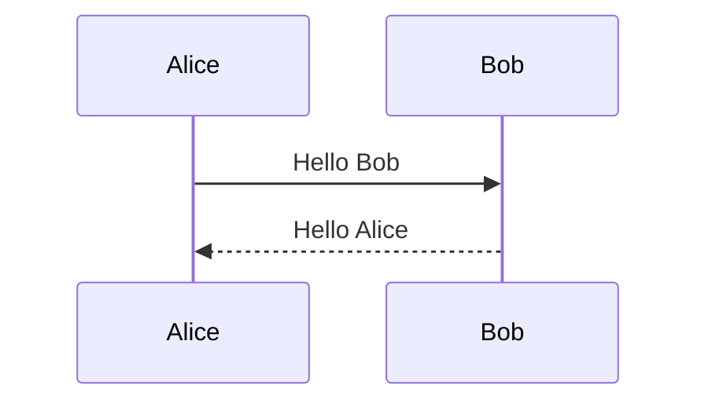


### Request / response


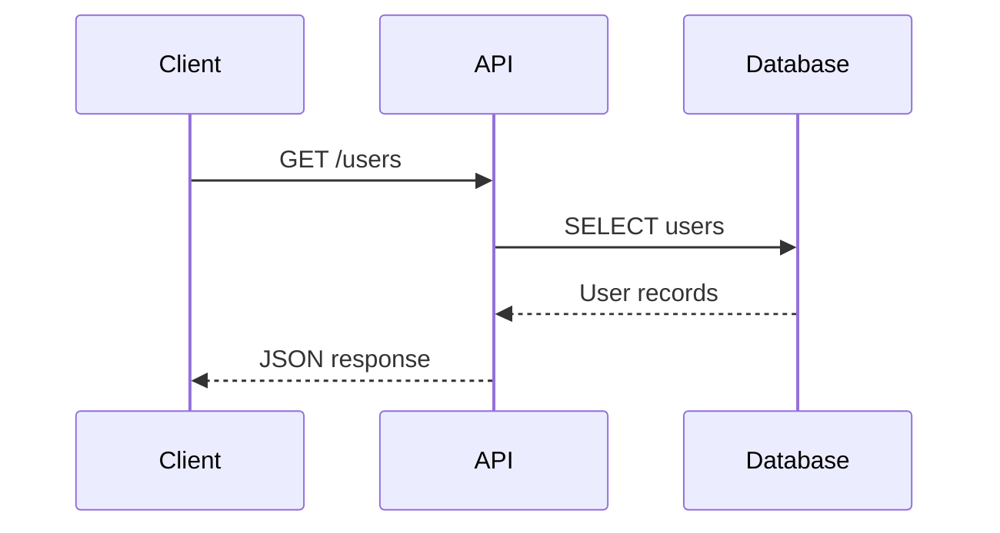


### Participants


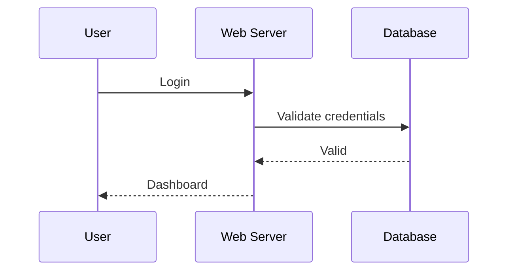


### Actor


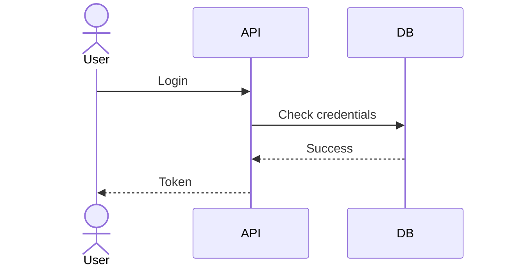


### Activation


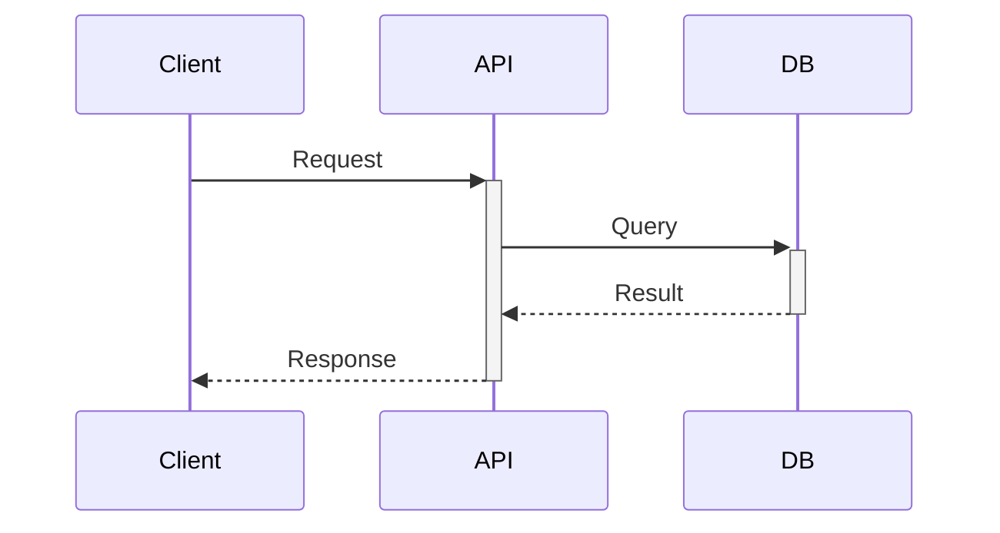


### Loop


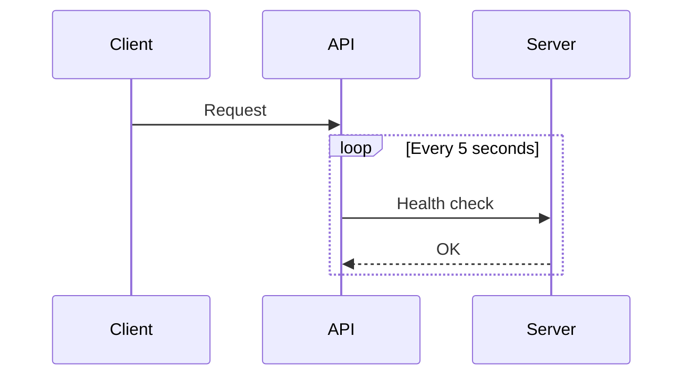


### Alt / else


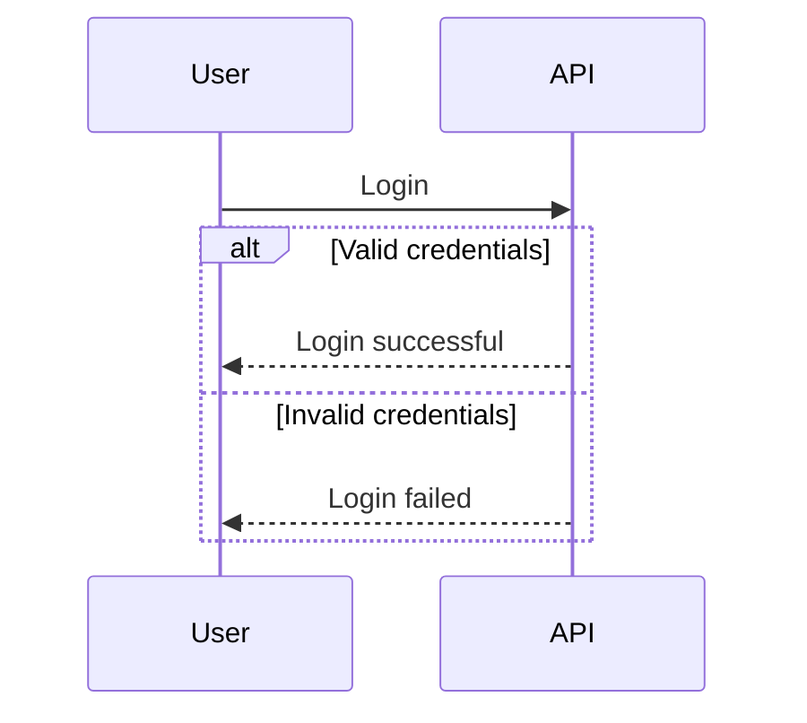


### Optional


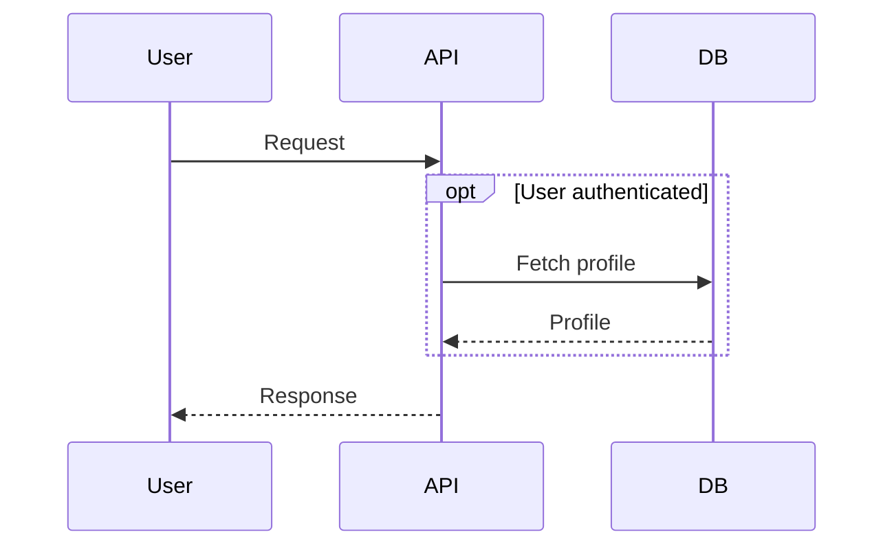


### Parallel


```mermaid

sequenceDiagram

    par Fetch users

        API->>UserDB: Query users

        UserDB-->>API: Users

    and Fetch orders

        API->>OrderDB: Query orders

        OrderDB-->>API: Orders

    end

```


### Critical section


```mermaid

sequenceDiagram

    Client->>Server: Request


    critical Database transaction

        Server->>DB: BEGIN

        Server->>DB: UPDATE

        DB-->>Server: COMMIT

    option Rollback

        Server->>DB: ROLLBACK

    end

```


### Notes


```mermaid

sequenceDiagram

    participant A

    participant B


    Note over A,B: Authentication process

    A->>B: Login request

    B-->>A: Token

```


### Boxes


```mermaid

sequenceDiagram

    box Frontend

        participant Browser

        participant Mobile

    end


    box Backend

        participant API

        participant DB

    end


    Browser->>API: Request

    Mobile->>API: Request

    API->>DB: Query

    DB-->>API: Result

```


---


# 4. Class Diagram


### Basic


```mermaid

classDiagram

    class User

    class Server

    class Database


    User --> Server

    Server --> Database

```


### Attributes


```mermaid

classDiagram

    class User {

        +String username

        +String email

        -String password

        +login()

        +logout()

    }

```


### Constructor


```mermaid

classDiagram

    class User {

        +String username

        +String email

        +User(username, email)

        +login()

    }

```


### Relationships


```mermaid

classDiagram

    User "1" --> "*" Order : places

    Order "1" --> "*" Product : contains

```


### Inheritance


```mermaid

classDiagram

    Animal <|-- Dog

    Animal <|-- Cat


    class Animal {

        +String name

        +eat()

    }


    class Dog {

        +bark()

    }


    class Cat {

        +meow()

    }

```


### Composition


```mermaid

classDiagram

    Computer *-- CPU

    Computer *-- RAM

    Computer *-- Storage

```


### Aggregation


```mermaid

classDiagram

    Department o-- Employee

```


### Interface


```mermaid

classDiagram

    class Payment {

        <<interface>>

        +pay()

    }


    class StripePayment {

        +pay()

    }


    Payment <|.. StripePayment

```


---


# 5. State Diagram


### Basic


```mermaid

stateDiagram-v2

    [*] --> Idle

    Idle --> Running

    Running --> Completed

    Completed --> [*]

```


### Transitions


```mermaid

stateDiagram-v2

    [*] --> Locked


    Locked --> Unlocked : correct password

    Unlocked --> Locked : logout

```


### Composite state


```mermaid

stateDiagram-v2

    [*] --> Active


    state Active {

        [*] --> Processing

        Processing --> Waiting

        Waiting --> Processing

        Processing --> [*]

    }


    Active --> Completed

    Completed --> [*]

```


### Choice


```mermaid

stateDiagram-v2

    [*] --> Processing

    Processing --> Decision


    state Decision <<choice>>


    Decision --> Success : valid

    Decision --> Failed : invalid


    Success --> [*]

    Failed --> [*]

```


### Fork / Join


```mermaid

stateDiagram-v2

    [*] --> Fork


    state Fork <<fork>>


    Fork --> Task1

    Fork --> Task2


    Task1 --> Join

    Task2 --> Join


    state Join <<join>>


    Join --> Completed

    Completed --> [*]

```


### Notes


```mermaid

stateDiagram-v2

    [*] --> Online

    Online --> Offline : disconnect


    note right of Online

        Server is reachable

    end note

```


---


# 6. Entity Relationship Diagram


### Basic


```mermaid

erDiagram

    USER ||--o{ ORDER : places

    ORDER ||--|{ ORDER_ITEM : contains

    PRODUCT ||--o{ ORDER_ITEM : included_in

```


### Attributes


```mermaid

erDiagram

    USER {

        int id PK

        string username

        string email UK

        string password

    }


    ORDER {

        int id PK

        int user_id FK

        date created_at

        string status

    }


    USER ||--o{ ORDER : places

```


### Full database example


```mermaid

erDiagram

    CUSTOMER ||--o{ ORDER : places

    ORDER ||--|{ ORDER_ITEM : contains

    PRODUCT ||--o{ ORDER_ITEM : included_in

    CATEGORY ||--o{ PRODUCT : contains


    CUSTOMER {

        int id PK

        string name

        string email UK

    }


    ORDER {

        int id PK

        int customer_id FK

        date order_date

        string status

    }


    ORDER_ITEM {

        int id PK

        int order_id FK

        int product_id FK

        int quantity

    }


    PRODUCT {

        int id PK

        int category_id FK

        string name

        decimal price

    }


    CATEGORY {

        int id PK

        string name

    }

```


### Cardinalities — GitHub-compatible alternative

```mermaid
classDiagram
    class A
    class B
    class C
    class D
    class E
    class F
    class G
    class H

    A "1" --> "1" B : one-to-one
    C "1" --> "*" D : one-to-many
    E "*" --> "*" F : many-to-many
    G "0..1" --> "0..1" H : optional-one
```

# 7. User Journey


```mermaid

journey

    title User Login Journey


    section Open Website

        Visit website: 5: User

        Enter username: 4: User


    section Authentication

        Enter password: 3: User

        Submit login: 4: User

        Authentication: 5: System


    section Dashboard

        View dashboard: 5: User

        Logout: 4: User

```


### Multiple users


```mermaid

journey

    title ISP Customer Journey


    section Registration

        Open portal: 5: Customer

        Submit registration: 4: Customer

        Verify email: 3: Customer, System


    section Installation

        Schedule installation: 4: Customer

        Technician visit: 5: Technician

        Activate service: 5: Technician


    section Support

        Open ticket: 3: Customer

        Resolve ticket: 4: Support

```


---


# 8. Gantt Chart


### Basic


```mermaid

gantt

    title Project Development

    dateFormat YYYY-MM-DD


    section Planning

    Requirements :done, req, 2026-09-01, 3d

    Design       :done, design, after req, 5d


    section Development

    Backend      :active, backend, after design, 10d

    Frontend     :frontend, after design, 12d


    section Testing

    Testing      :testing, after backend, 5d

```


### Milestones


```mermaid

gantt

    title Infrastructure Deployment

    dateFormat YYYY-MM-DD


    section Infrastructure

    Server setup :setup, 2026-09-15, 3d

    Network      :network, after setup, 2d

    Firewall     :firewall, after network, 2d


    Deployment milestone :milestone, deploy, after firewall, 0d

```


### Dependencies


```mermaid

gantt

    title Software Release

    dateFormat YYYY-MM-DD


    section Development

    Code :code, 2026-09-01, 7d

    Review :review, after code, 3d


    section Release

    Build :build, after review, 2d

    Deploy :deploy, after build, 1d

```


---


# 9. Pie Chart


```mermaid

pie title Server Resource Usage

    "Application" : 40

    "Database" : 25

    "Cache" : 15

    "Other" : 20

```


### Network traffic


```mermaid

pie title Network Traffic

    "HTTP" : 45

    "HTTPS" : 35

    "DNS" : 10

    "SSH" : 5

    "Other" : 5

```


---


# 10. Quadrant Chart


```mermaid

quadrantChart

    title Technology Priority

    x-axis Low Effort --> High Effort

    y-axis Low Impact --> High Impact


    quadrant-1 Strategic

    quadrant-2 Quick Wins

    quadrant-3 Low Priority

    quadrant-4 Major Projects


    Mermaid: [0.3, 0.8]

    Docker: [0.4, 0.7]

    Kubernetes: [0.8, 0.9]

    Legacy System: [0.7, 0.3]

```


### Security priorities


```mermaid

quadrantChart

    title Security Priorities

    x-axis Easy --> Difficult

    y-axis Low Risk --> High Risk


    quadrant-1 Critical

    quadrant-2 Immediate

    quadrant-3 Monitor

    quadrant-4 Planned


    Weak Passwords: [0.2, 0.9]

    Missing Patches: [0.4, 0.8]

    Old Firewall: [0.7, 0.7]

    Legacy Application: [0.9, 0.6]

    Documentation: [0.3, 0.2]

```


---

# 11. Requirement Diagram — GitHub-compatible alternative

### Basic requirement

```mermaid
flowchart LR
    R1["REQ-001<br/>User must authenticate before accessing the portal"]
    R1 --> V1["Verification: Test"]
    R1 --> Risk1["Risk: High"]
```

### Requirement + element

```mermaid
flowchart LR
    R1["REQ-001<br/>System shall authenticate users"]
    Login["Login Page<br/>Web Page"]

    R1 -->|satisfies| Login
    R1 --> V["Verification: Test"]
    R1 --> Risk["Risk: High"]
```

### Multiple requirements

```mermaid
flowchart TB
    R1["REQ-001<br/>99.9% availability"]
    R2["REQ-002<br/>API response below 500ms"]
    R3["REQ-003<br/>All communication shall use HTTPS"]

    R1 --> V1["Analysis"]
    R2 --> V2["Test"]
    R3 --> V3["Inspection"]

    R1 --> K1["Risk: High"]
    R2 --> K2["Risk: Medium"]
    R3 --> K3["Risk: High"]
```

### Requirement relationships

```mermaid
flowchart LR
    A["Requirement A"]
    B["Requirement B"]
    C["Requirement C"]
    D["Requirement D"]

    A -->|contains| B
    A -->|copies| C
    B -->|derives| C
    C -->|satisfies| D
    D -->|verifies| A
    A -->|refines| B
    B -->|traces| D
```

### Direction

```mermaid
flowchart LR
    SYS["SYS-001<br/>System requirement"]
    API["API-001<br/>API requirement"]
    SYS -->|contains| API
```

# 12. Use Case Diagram — GitHub-compatible alternative

### Basic

```mermaid
flowchart LR
    User([User])
    Admin([Administrator])

    Login((Login))
    Dashboard((View Dashboard))
    ManageUsers((Manage Users))
    Reports((View Reports))

    User --> Login
    User --> Dashboard
    Admin --> ManageUsers
    Admin --> Reports
```

### System boundary

```mermaid
flowchart LR
    User([User])

    subgraph System["ISP Portal"]
        Login((Login))
        ViewProfile((View Profile))
        ChangePassword((Change Password))
    end

    User --> Login
    User --> ViewProfile
    User --> ChangePassword
```

### Include / extend

```mermaid
flowchart LR
    User([User])
    Login((Login))
    Validate((Validate Credentials))
    MFA((Verify MFA))
    Dashboard((Open Dashboard))

    User --> Login
    Login -.->|include| Validate
    Login -.->|include| MFA
    Login -.->|extend| Dashboard
```

### Direction

```mermaid
flowchart LR
    User([User])
    Admin([Admin])

    subgraph ISP["ISP Portal"]
        Login((Login))
        Dashboard((Dashboard))
        ManageUsers((Manage Users))
    end

    User --> Login
    User --> Dashboard
    Admin --> ManageUsers
```

# 13. GitGraph


### Basic


```mermaid

gitGraph

    commit

    commit

    commit

```


### Commit messages


```mermaid

gitGraph

    commit id: "Initial"

    commit id: "Add login"

    commit id: "Add dashboard"

```


### Branch


```mermaid

gitGraph

    commit id: "Initial"


    branch develop

    checkout develop


    commit id: "Feature A"

    commit id: "Feature B"

```


### Merge


```mermaid

gitGraph

    commit id: "Initial"


    branch develop

    checkout develop

    commit id: "Development"


    checkout main

    commit id: "Hotfix"


    merge develop

    commit id: "Release"

```


### Feature branches


```mermaid

gitGraph

    commit id: "Initial"


    branch feature-login

    checkout feature-login

    commit id: "Login UI"

    commit id: "Login API"


    checkout main

    branch feature-dashboard

    checkout feature-dashboard

    commit id: "Dashboard"


    checkout main

    merge feature-login

    merge feature-dashboard

```


### Cherry-pick


```mermaid

gitGraph

    commit id: "A"

    commit id: "B"


    branch feature

    checkout feature

    commit id: "C"


    checkout main

    commit id: "D"


    cherry-pick id: "C"

```


### Tags


```mermaid

gitGraph

    commit id: "Initial"

    commit id: "Feature 1"

    commit tag: "v1.0.0"

    commit id: "Feature 2"

    commit tag: "v1.1.0"

```


### Commit types


```mermaid

gitGraph

    commit type: HIGHLIGHT id: "Important"

    commit type: REVERSE id: "Reverted"

    commit type: NORMAL id: "Normal"

```


### Hide branches / labels


```mermaid

---

config:

  gitGraph:

    showBranches: false

    showCommitLabel: false

---


gitGraph

    commit

    branch develop

    commit

    checkout main

    commit

```


### Orientation


```mermaid

gitGraph LR:

    commit

    branch develop

    checkout develop

    commit

    checkout main

    merge develop

```


```mermaid

gitGraph TB:

    commit

    branch develop

    checkout develop

    commit

```


```mermaid

gitGraph BT:

    commit

    branch develop

    checkout develop

    commit

```


([Mermaid][3])


---


# 14. C4 Diagram


## C4Context


```mermaid

C4Context


Person(user, "User", "Portal user")


System(portal, "ISP Portal", "Customer management system")


System_Ext(payment, "Payment Gateway", "External payment service")


Rel(user, portal, "Uses")

Rel(portal, payment, "Processes payments")

```


### Context with descriptions


```mermaid

C4Context


Person(customer, "Customer", "ISP customer")

Person(agent, "Support Agent", "Handles support tickets")


System(isp, "ISP Portal", "Customer and service management")

System_Ext(email, "Email Service", "Sends notifications")

System_Ext(payment, "Payment Gateway", "Processes payments")


Rel(customer, isp, "Uses")

Rel(agent, isp, "Manages customers")

Rel(isp, email, "Sends email")

Rel(isp, payment, "Processes payments")

```


---


## C4Container


```mermaid

C4Container


Person(user, "User")


System_Boundary(isp, "ISP Portal") {


    Container(web, "Web Application", "Django", "Frontend")

    Container(api, "API", "Django REST", "Backend API")

    ContainerDb(db, "Database", "PostgreSQL", "Stores application data")

    ContainerDb(cache, "Cache", "Redis", "Session/cache data")

}


Rel(user, web, "Uses")

Rel(web, api, "Calls")

Rel(api, db, "Reads/Writes")

Rel(api, cache, "Uses")

```


---


## C4Component


```mermaid

C4Component


Container_Boundary(api, "API Server") {


    Component(auth, "Authentication", "Django", "Handles login")

    Component(users, "User Service", "Django", "Manages users")

    Component(billing, "Billing Service", "Django", "Handles billing")

}


ContainerDb(db, "Database", "PostgreSQL")


Rel(auth, users, "Authenticates")

Rel(users, db, "Reads/Writes")

Rel(billing, db, "Reads/Writes")

```


---


## C4Dynamic


```mermaid

C4Dynamic


Person(user, "User")

Container(web, "Web Application")

Container(api, "API")

ContainerDb(db, "Database")


Rel(user, web, "1. Login")

Rel(web, api, "2. POST credentials")

Rel(api, db, "3. Validate user")

Rel(db, api, "4. User found")

Rel(api, web, "5. Session")

Rel(web, user, "6. Dashboard")

```


---


## C4Deployment


```mermaid

C4Deployment


Deployment_Node(server, "Ubuntu Server", "Linux") {


    Deployment_Node(docker, "Docker Host") {


        Container(web, "Web App", "Django")

        Container(api, "API", "Django")

        ContainerDb(db, "PostgreSQL")

    }

}

```


### Deployment with users


```mermaid

C4Deployment


Person(user, "User")


Deployment_Node(server, "Production Server", "Ubuntu 24.04") {


    Deployment_Node(docker, "Docker") {


        Container(web, "Frontend", "Nginx")

        Container(api, "Backend", "Django")

        ContainerDb(db, "Database", "PostgreSQL")

    }

}


Rel(user, web, "HTTPS")

Rel(web, api, "HTTP")

Rel(api, db, "SQL")

```


([Mermaid][4])


---


# 15. Mindmap — GitHub-compatible alternative

```mermaid
flowchart TB
    Root((ISP Technology))

    Root --> Linux[Linux]
    Root --> Networking[Networking]
    Root --> Cloud[Cloud]
    Root --> DevOps[DevOps]
    Root --> AI[AI & Machine Learning]

    Linux --> Ubuntu[Ubuntu]
    Linux --> Termux[Termux]
    Networking --> TCPIP[TCP/IP]
    Networking --> DNS[DNS]
    Networking --> HTTP[HTTP]
    Cloud --> AWS[AWS]
    Cloud --> Azure[Azure]
    DevOps --> Docker[Docker]
    DevOps --> Kubernetes[Kubernetes]
    DevOps --> CI[CI/CD]
    AI --> LLM[LLM]
    AI --> LocalAI[Local AI]
```

# 16. Timeline


### Basic


```mermaid

timeline

    title Evolution of the Internet


    1969 : ARPANET

    1983 : TCP/IP

    1989 : World Wide Web

    1991 : Web becomes public

    2004 : Web 2.0

    2007 : Smartphones

    2020 : Cloud becomes mainstream

```


### Multiple events


```mermaid

timeline

    title Linux History


    1991 : Linux kernel released

         : Open source development begins


    1996 : Linux 2.0

         : SMP support


    2003 : Linux 2.6

         : Major kernel improvements


    2011 : Linux 3.0

         : New version numbering


    2015 : Linux 4.0


    2019 : Linux 5.0


    2024 : Linux 6.x

```


### Sections


```mermaid

timeline

    title Web Evolution


    section Web 1.0

        1991 : Static websites

        1995 : JavaScript

        1996 : CSS


    section Web 2.0

        2004 : Social media

        2005 : AJAX

        2006 : Cloud platforms


    section Web 3.0

        2015 : Modern web applications

        2020 : Web APIs

        2024 : AI-powered applications

```


### Technology timeline


```mermaid

timeline

    title Authentication Evolution


    section Traditional

        1960s : Passwords

        1970s : Unix passwords


    section Network

        1980s : Kerberos

        1990s : LDAP


    section Web

        2000s : SSO

        2010s : OAuth

        2010s : OpenID Connect


    section Modern

        2020s : Passkeys

        2020s : Passwordless authentication

```


([Mermaid][5])


---


# 17. ZenUML — GitHub-compatible alternative

### Basic

```mermaid
sequenceDiagram
    participant Client
    participant OrderController
    participant OrderService

    Client->>OrderController: POST /orders
    OrderController->>OrderService: create payload
    OrderService-->>OrderController: Order created
    OrderController-->>Client: 201 Created
```

### Nested service flow

```mermaid
sequenceDiagram
    participant Client
    participant API
    participant OrderService
    participant PurchaseService
    participant InvoiceService

    Client->>API: POST /orders
    API->>OrderService: create payload
    OrderService->>PurchaseService: create purchase order
    OrderService->>InvoiceService: create invoice
    PurchaseService-->>OrderService: PO created
    InvoiceService-->>OrderService: Invoice created
    OrderService-->>API: Order created
    API-->>Client: Response
```

### Conditional flow

```mermaid
sequenceDiagram
    participant Client
    participant API
    participant DB

    Client->>API: Login
    API->>DB: Validate credentials

    alt Credentials valid
        DB-->>API: Valid
        API-->>Client: Authentication token
    else Credentials invalid
        DB-->>API: Invalid
        API-->>Client: 401 Unauthorized
    end
```

### Parallel operations

```mermaid
sequenceDiagram
    participant API
    participant Payment
    participant Inventory
    participant Notification

    par Process payment
        API->>Payment: Charge customer
    and Reserve inventory
        API->>Inventory: Reserve item
    and Send notification
        API->>Notification: Send order event
    end
```

# 18. Sankey


### Basic


```mermaid

sankey


A,B,10

A,C,20

B,D,5

C,D,15

```


### Server traffic


```mermaid

sankey


Internet,Firewall,100

Firewall,Load Balancer,90

Firewall,Blocked,10

Load Balancer,Web Server,70

Load Balancer,API Server,20

Web Server,Database,30

API Server,Database,40

```


### Cloud resources


```mermaid

sankey


Users,Frontend,1000

Frontend,API,800

Frontend,Cache,200

API,Database,600

API,Queue,200

Queue,Worker,200

```


### Energy flow


```mermaid

sankey


Solar,Inverter,100

Grid,Inverter,50

Inverter,House,120

Inverter,Battery,30

Battery,House,20

```


### More complex


```mermaid

sankey


Source A,Process 1,100

Source B,Process 1,50

Source C,Process 2,80

Process 1,Process 2,40

Process 1,Output A,110

Process 2,Output B,100

Process 2,Waste,20

```


([Mermaid][7])


---


# 19. XY Chart


### Basic line


```mermaid

xychart

    line [10, 20, 30, 40, 50]

```


### Basic bar


```mermaid

xychart

    bar [10, 20, 30, 40, 50]

```


### Title


```mermaid

xychart

    title "Monthly Users"

    bar [100, 150, 200, 280, 350]

```


### X/Y axes


```mermaid

xychart

    title "Server Load"

    x-axis ["Mon", "Tue", "Wed", "Thu", "Fri"]

    y-axis "CPU %" 0 --> 100

    line [30, 45, 55, 70, 50]

```


### Bar + line


```mermaid

xychart

    title "Revenue"

    x-axis [Jan, Feb, Mar, Apr, May]

    y-axis "Revenue" 0 --> 100

    bar [20, 35, 45, 60, 80]

    line [20, 35, 45, 60, 80]

```


### Named series


```mermaid

xychart

    title "Traffic"

    x-axis [Jan, Feb, Mar, Apr]

    y-axis "Requests" 0 --> 1000


    bar "HTTP" [500, 600, 700, 800]

    bar "HTTPS" [300, 500, 750, 900]


    line "Total" [800, 1100, 1450, 1700]

```


### Horizontal


```mermaid
xychart horizontal
  title "Department Budget"
  x-axis ["IT", "HR", "Sales", "Support"]
  y-axis "Budget" 0 --> 100
  bar [80, 40, 70, 50]
```


### Line point labels


```mermaid

xychart

    title "Temperature"

    x-axis ["Mon", "Tue", "Wed", "Thu", "Fri"]

    y-axis "°C" 0 --> 40


    line [25 "25°C", 27 "27°C", 30 "30°C", 28 "28°C", 26 "26°C"]

```


### Multiple lines


```mermaid

xychart

    title "Network Performance"

    x-axis [1, 2, 3, 4, 5]

    y-axis "Mbps" 0 --> 1000


    line "Download" [500, 600, 700, 800, 900]

    line "Upload" [100, 150, 200, 250, 300]

```


([Mermaid][8])


---


# 20. Block Diagram


### Basic


```mermaid

block-beta
    A

    B

    C

```


### Horizontal blocks


```mermaid

block-beta
    A --> B --> C

```


### Columns


```mermaid

block-beta
    columns 3

    A

    B

    C

    D

```


### Multiple columns


```mermaid

block-beta
    columns 4


    A

    B

    C

    D

    E

    F

```


### Connections


```mermaid

block-beta
    A --> B

    B --> C

    C --> D

```


### Database architecture


```mermaid

block-beta
    columns 3


    Client

    API

    Database


    Client --> API

    API --> Database

```


### Composite block


```mermaid

block-beta
    block:frontend

        Browser

        Mobile

    end


    block:backend

        API

        Worker

    end


    frontend --> backend

```


### Nested system


```mermaid

block-beta
    block:cloud

        columns 2


        block:frontend

            Web

            Mobile

        end


        block:backend

            API

            Worker

        end

    end

```


### Block width


```mermaid

block-beta
    columns 3


    A

    B:2

    C

    D

```


### Shapes


```mermaid

block-beta
    A

    round B

    stadium C

    subroutine D

    cylinder E

    circle F

    hexagon G

    rhombus H

```


### Special shapes


```mermaid

block-beta
    A:3

    B:2

    C

    space

    D

```


### Architecture-style system


```mermaid

block-beta
    columns 3


    block:users

        User

        Admin

    end


    block:services

        Web

        API

        Worker

    end


    block:data

        Database

        Redis

        Storage

    end


    users --> services

    services --> data

```


### Styled blocks


```mermaid

block-beta
    A

    B

    C


    classDef primary fill:#e3f2fd,stroke:#1565c0

    classDef database fill:#e8f5e9,stroke:#2e7d32


    class A,B primary

    class C database

```


([Mermaid][9])


---

## 21. Packet Diagram


### Basic


```mermaid

packet-beta

0-7: "Version"

8-15: "IHL"

16-31: "Total Length"

32-63: "Source Address"

64-95: "Destination Address"

```


### IPv4-style


```mermaid

packet-beta

0-3: "Version"

4-7: "IHL"

8-15: "DSCP"

16-17: "ECN"

18-31: "Total Length"

32-47: "Identification"

48-50: "Flags"

51-63: "Fragment Offset"

64-71: "TTL"

72-79: "Protocol"

80-95: "Checksum"

96-127: "Source IP"

128-159: "Destination IP"

```


### TCP-style


```mermaid

packet-beta

0-15: "Source Port"

16-31: "Destination Port"

32-63: "Sequence Number"

64-95: "Acknowledgment Number"

96-99: "Data Offset"

100-105: "Reserved"

106: "URG"

107: "ACK"

108: "PSH"

109: "RST"

110: "SYN"

111: "FIN"

112-127: "Window"

128-143: "Checksum"

144-159: "Urgent Pointer"

```


### Custom network packet


```mermaid

packet-beta

0-7: "Header"

8-15: "Type"

16-31: "Length"

32-63: "Source"

64-95: "Destination"

96-127: "Payload"

128-159: "CRC"

```


---


# 22. Kanban — GitHub-compatible alternative

### Basic

```mermaid
flowchart LR
    subgraph Todo["Todo"]
        T1["Network design"]
        T2["Firewall rules"]
    end

    subgraph Progress["In Progress"]
        P1["Server configuration"]
    end

    subgraph Done["Done"]
        D1["Documentation"]
    end
```

### Priorities

```mermaid
flowchart LR
    subgraph Backlog["Backlog"]
        B1["Implement LDAP"]
        B2["Add monitoring"]
        B3["Write documentation"]
    end

    subgraph Development["Development"]
        D1["Build authentication"]
    end

    subgraph Testing["Testing"]
        T1["Test login"]
    end

    subgraph Done["Done"]
        F1["Docker setup"]
    end
```

### Assignee

```mermaid
flowchart LR
    subgraph Todo["Todo"]
        T1["Network design<br/>Assignee: Sherif"]
        T2["Firewall rules<br/>Assignee: Admin"]
    end

    subgraph Progress["In Progress"]
        P1["Server configuration<br/>Assignee: DevOps"]
    end

    subgraph Done["Done"]
        D1["Documentation<br/>Assignee: Sherif"]
    end
```

### Sections

```mermaid
flowchart LR
    subgraph Requirements["Requirements"]
        R1["Gather requirements"]
        R2["Define architecture"]
    end

    subgraph Development["Development"]
        D1["Backend"]
        D2["Frontend"]
    end

    subgraph Testing["Testing"]
        T1["Unit tests"]
        T2["Integration tests"]
    end

    subgraph Deployment["Deployment"]
        P1["Production deployment"]
    end
```

# 23. Architecture Diagram — GitHub-compatible alternative

### Basic

```mermaid
flowchart LR
    User["User"]
    Web["Web Server"]
    API["API Server"]
    DB[("Database")]

    User --> Web
    Web --> API
    API --> DB
```

### Cloud architecture

```mermaid
flowchart TB
    subgraph Cloud["Cloud"]
        User["Internet"]
        LB["Load Balancer"]
        API["API"]
        DB[("PostgreSQL")]
        Cache[("Redis")]

        User --> LB
        LB --> API
        API --> DB
        API --> Cache
    end
```

### AWS-style

```mermaid
flowchart LR
    subgraph AWS["AWS"]
        EC2["EC2"]
        RDS[("RDS")]
        S3["S3"]
        Redis[("ElastiCache")]

        EC2 --> RDS
        EC2 --> Redis
        EC2 --> S3
    end
```

### Multiple EC2 servers

```mermaid
flowchart TB
    LB["Load Balancer"]

    subgraph Apps["Application Servers"]
        Web1["EC2 1"]
        Web2["EC2 2"]
        Web3["EC2 3"]
    end

    DB[("RDS")]

    LB --> Web1
    LB --> Web2
    LB --> Web3
    Web1 --> DB
    Web2 --> DB
    Web3 --> DB
```

### Network architecture

```mermaid
flowchart LR
    Internet["Internet"]
    Firewall["Firewall"]
    Router["Router"]
    Switch["Switch"]
    Server["Server"]
    DB[("Database")]

    Internet --> Firewall
    Firewall --> Router
    Router --> Switch
    Switch --> Server
    Server --> DB
```

### Directional edges

```mermaid
flowchart LR
    A["Service A"]
    B["Service B"]
    C[("Database")]

    A --> B
    B --> C
    C --> A
```

# 24. Radar Chart


```mermaid

radar-beta

    title Technology Skills


    axis linux["Linux"]

    axis docker["Docker"]

    axis kubernetes["Kubernetes"]

    axis python["Python"]

    axis networking["Networking"]


    curve skills["Current Skills"]{80,70,50,75,90}

```


### Multiple curves


```mermaid

radar-beta

    title DevOps Comparison


    axis linux["Linux"]

    axis docker["Docker"]

    axis kubernetes["Kubernetes"]

    axis cloud["Cloud"]

    axis cicd["CI/CD"]


    curve beginner["Beginner"]{40,30,20,30,25}

    curve intermediate["Intermediate"]{70,70,55,65,60}

```


### Styled


```mermaid

radar-beta

    title Server Evaluation


    axis cpu["CPU"]

    axis memory["Memory"]

    axis storage["Storage"]

    axis network["Network"]

    axis security["Security"]


    curve server1["Server A"]{80,90,70,95,85}

    curve server2["Server B"]{70,80,90,75,90}

```


---


# 25. Event Modeling


### Basic


```mermaid

block-beta

    columns 3


    Command["Command: Place Order"]

    Event["Event: Order Placed"]

    ReadModel["Read Model: Order List"]


    Command --> Event

    Event --> ReadModel

```


### Event flow


```mermaid

block-beta

    columns 4


    User["User"]

    Command["Place Order"]

    Event["OrderPlaced"]

    Projection["Order View"]


    User --> Command

    Command --> Event

    Event --> Projection

```


### Multiple events


```mermaid

block-beta

    columns 5


    Place["Place Order"]

    Placed["Order Placed"]

    Paid["Payment Received"]

    Shipped["Order Shipped"]

    Delivered["Order Delivered"]


    Place --> Placed

    Placed --> Paid

    Paid --> Shipped

    Shipped --> Delivered

```


### Command → Event → Policy


```mermaid

block-beta

    columns 3


    Command["Command"]

    Event["Event"]

    Policy["Policy"]


    Command --> Event

    Event --> Policy

```


---


# 26. Treemap


### Basic


```mermaid

treemap-beta

    "Technology"

        "Linux": 30

        "Docker": 25

        "Kubernetes": 20

        "Python": 15

        "Networking": 10

```


### Nested


```mermaid

treemap-beta

    "Cloud"

        "AWS"

            "EC2": 30

            "S3": 20

            "RDS": 25

        "Azure"

            "VM": 15

            "Storage": 10

```


### Infrastructure


```mermaid

treemap-beta

    "Infrastructure"

        "Compute"

            "Web Servers": 30

            "Application Servers": 25

            "Workers": 15

        "Storage"

            "Database": 20

            "Object Storage": 10

```


---


# 27. Venn Diagram — GitHub-compatible alternative

### Two sets

```mermaid
flowchart LR
    Linux["Linux — 80"]
    Docker["Docker — 60"]
    Both["Linux + Docker — 40"]

    Linux --> Both
    Docker --> Both
```

### Three sets

```mermaid
flowchart TB
    Python["Python — 80"]
    Linux["Linux — 70"]
    Docker["Docker — 60"]

    PythonLinux["Python + Linux — 40"]
    PythonDocker["Python + Docker — 35"]
    LinuxDocker["Linux + Docker — 30"]
    All["All Three — 20"]

    Python --> PythonLinux
    Linux --> PythonLinux
    Python --> PythonDocker
    Docker --> PythonDocker
    Linux --> LinuxDocker
    Docker --> LinuxDocker
    PythonLinux --> All
    PythonDocker --> All
    LinuxDocker --> All
```

# 28. Ishikawa / Fishbone — GitHub-compatible alternative

### Production outage

```mermaid
flowchart LR
    Process["Process"]
    People["People"]
    Technology["Technology"]
    Environment["Environment"]
    Problem["Production Outage"]

    Monitoring["No monitoring"] --> Process
    Change["Poor change management"] --> Process
    Escalation["Missing escalation"] --> Process
    Skills["Insufficient training"] --> People
    Handover["Poor handover"] --> People
    Server["Server failure"] --> Technology
    Network["Network failure"] --> Technology
    Database["Database failure"] --> Technology
    Power["Power issue"] --> Environment
    Provider["ISP/provider issue"] --> Environment

    Process --> Problem
    People --> Problem
    Technology --> Problem
    Environment --> Problem
```

### ISP troubleshooting

```mermaid
flowchart TB
    Problem["Customer Internet Down"]

    Physical["Physical"]
    Cable["Cable damaged"]
    Power["ONT/Router power issue"]
    Network["Network"]
    DHCP["DHCP failure"]
    DNS["DNS failure"]
    Routing["Routing issue"]
    Authentication["Authentication"]
    PPPoE["PPPoE failure"]
    Account["Account suspended"]

    Physical --> Problem
    Cable --> Physical
    Power --> Physical
    Network --> Problem
    DHCP --> Network
    DNS --> Network
    Routing --> Network
    Authentication --> Problem
    PPPoE --> Authentication
    Account --> Authentication
```

# 29. Wardley Map — GitHub-compatible alternative

`wardley-beta` is not available in the Mermaid v11.17.2 bundle used by GitHub. Use a flowchart to represent the same dependency direction.

### Online Store

```mermaid
flowchart LR
    Customer["Customer"]
    Website["Website"]
    Payment["Payment"]
    Database[("Database")]
    Cloud["Cloud"]

    Website --> Customer
    Payment --> Website
    Database --> Website
    Cloud --> Database
```

### ISP Platform

```mermaid
flowchart LR
    Customer["Customer"]
    Portal["Portal"]
    API["API"]
    Database[("Database")]
    Kubernetes["Kubernetes"]
    Cloud["Cloud"]

    Portal --> Customer
    API --> Portal
    Database --> API
    Kubernetes --> API
    Cloud --> Kubernetes
```


# 30. Cynefin — GitHub-compatible alternative

### Basic

```mermaid
flowchart TB
    subgraph Clear["CLEAR"]
        C1["Restart service"]
        C2["Apply known fix"]
    end

    subgraph Complicated["COMPLICATED"]
        CP1["Analyze logs"]
        CP2["Expert review"]
    end

    subgraph Complex["COMPLEX"]
        CX1["Investigate root cause"]
        CX2["Run experiments"]
    end

    subgraph Chaotic["CHAOTIC"]
        CH1["Page on-call"]
        CH2["Stabilize system"]
    end

    Confusion["CONFUSION<br/>Unknown failure"]

    Confusion --> Complex
    Complex --> Complicated
    Complicated --> Clear
    Clear --> Chaotic
    Chaotic --> Complex
```

### Incident management

```mermaid
flowchart LR
    subgraph Clear["CLEAR"]
        A["Known failure"]
        B["Standard procedure"]
    end

    subgraph Complicated["COMPLICATED"]
        C["Performance issue"]
        D["Requires specialist"]
    end

    subgraph Complex["COMPLEX"]
        E["Unknown dependency"]
        F["Emergent behavior"]
    end

    subgraph Chaotic["CHAOTIC"]
        G["Active outage"]
        H["Data corruption"]
    end

    Confusion["CONFUSION<br/>Cause unknown"] --> Complex
```

### Relationships

```mermaid
flowchart LR
    Clear["CLEAR<br/>Known procedure"]
    Complicated["COMPLICATED<br/>Expert analysis"]
    Complex["COMPLEX<br/>Experimentation"]
    Chaotic["CHAOTIC<br/>Immediate action"]
    Confusion["CONFUSION<br/>Assess situation"]

    Complex -->|Pattern identified| Complicated
    Complicated -->|Standardized| Clear
    Clear -->|Sudden failure| Chaotic
    Chaotic -->|Stabilized| Complex
    Confusion -->|Safe to experiment| Complex
```

# 31. TreeView


### Basic


```mermaid

treeView-beta

    root/

        src/

            app.py

            config.py

            models.py

        tests/

            test_app.py

        README.md

        requirements.txt

```


### Project


```mermaid

treeView-beta

    my-project/

        src/

            components/

                Button.tsx

                Header.tsx

            pages/

                Home.tsx

                Login.tsx

            App.tsx

            index.ts

        public/

            favicon.ico

        tests/

            test_app.ts

        package.json

        README.md

```


### Linux filesystem


```mermaid

treeView-beta

    /

        etc/

            nginx/

                nginx.conf

        var/

            www/

                html/

                    index.html

        home/

            user/

                projects/

                    app/

        opt/

            services/

```


---


# 32. Packet + Network Example


```mermaid

flowchart LR

    Client["Client"]

    Router["Router"]

    Firewall["Firewall"]

    Server["Server"]


    Client -->|"TCP SYN"| Router

    Router --> Firewall

    Firewall -->|"TCP SYN"| Server


    Server -->|"TCP SYN-ACK"| Firewall

    Firewall --> Router

    Router -->|"TCP SYN-ACK"| Client

```


---


# 33. Complete DevOps Architecture Example


```mermaid
architecture-beta
group production(cloud)[Production]

service internet(internet)[Internet] in production
service lb(server)[Load Balancer] in production
group app(server)[Application Layer] in production
service web1(server)[Web Server 1] in app
service web2(server)[Web Server 2] in app
service api(server)[API Server] in app
group data(server)[Data Layer] in production
service postgres(database)[PostgreSQL] in data
service redis(database)[Redis] in data
service storage(disk)[Object Storage] in data

internet:R --> L:lb
lb:R --> L:web1
lb:R --> L:web2
web1:R --> L:api
web2:R --> L:api
api:R --> L:postgres
api:B --> T:redis
api:R --> L:storage
```


---


# 34. Complete ISP Architecture Example


```mermaid

flowchart TB

    Internet((Internet))


    subgraph Core["ISP Core"]

        Router[Core Router]

        BGP[BGP]

        Firewall[Firewall]

    end


    subgraph Services["Service Layer"]

        DNS[DNS]

        DHCP[DHCP]

        AAA[AAA / RADIUS]

        Portal[Customer Portal]

    end


    subgraph Access["Access Network"]

        OLT[OLT]

        ONT[ONT]

        CPE[Customer Router]

    end


    subgraph Data["Data Layer"]

        DB[(PostgreSQL)]

        Redis[(Redis)]

        Logs[(Logs)]

    end


    Internet --> Router

    Router --> BGP

    Router --> Firewall


    Firewall --> DNS

    Firewall --> DHCP

    Firewall --> AAA

    Firewall --> Portal


    Router --> OLT

    OLT --> ONT

    ONT --> CPE


    Portal --> DB

    Portal --> Redis

    AAA --> DB

    DNS --> DB

    DHCP --> DB


    Portal --> Logs

    AAA --> Logs

```


---


# 35. Complete CI/CD Example


```mermaid

flowchart LR

    Developer --> GitHub


    subgraph CI["CI Pipeline"]

        GitHub --> Build

        Build --> Test

        Test --> Security

    end


    Security --> Docker

    Docker --> Registry


    subgraph CD["CD"]

        Registry --> Staging

        Staging --> Approval

        Approval --> Production

    end


    Production --> Monitoring

    Monitoring --> Alert

    Alert --> Developer

```


---


# 36. Complete Kubernetes Example


```mermaid

flowchart TB

    User((User)) --> Ingress


    subgraph Kubernetes["Kubernetes Cluster"]

        Ingress[Ingress]


        subgraph Namespace["Application Namespace"]

            Service[Service]


            subgraph Pods["Pods"]

                Pod1[Pod 1]

                Pod2[Pod 2]

                Pod3[Pod 3]

            end


            Service --> Pod1

            Service --> Pod2

            Service --> Pod3

        end


        Ingress --> Service

    end


    Pod1 --> DB[(PostgreSQL)]

    Pod2 --> DB

    Pod3 --> DB

```


---


# 37. Images inside Mermaid


This is the part relevant to your **EC2/server/database images** question.


### Image node


```mermaid

flowchart LR

    A[""]

```


### Image with label


```mermaid

flowchart LR

    A["<br/>EC2 Server"]

```


### Architecture icons


```mermaid

architecture-beta

    service server(server)[EC2 Server]

    service database(database)[RDS Database]


    server:R --> L:database

```


### Iconify-style icons


```mermaid

architecture-beta

    service server(server)[EC2]

    service database(database)[Database]

    service user(internet)[Users]


    user:R --> L:server

    server:R --> L:database

```


---


# 38. Font Awesome Icons


```mermaid

flowchart LR

    A["fa:fa-user User"] --> B["fa:fa-server Server"]

    B --> C["fa:fa-database Database"]

```


### AWS-style labels


```mermaid

flowchart LR

    User["fa:fa-user User"]

    EC2["fa:fa-server EC2"]

    DB["fa:fa-database RDS"]

    Storage["fa:fa-hdd S3"]


    User --> EC2

    EC2 --> DB

    EC2 --> Storage

```


---


# 39. Inline HTML / Markdown


```mermaid

flowchart LR

    A["**Bold text**"]

    B["*Italic text*"]

    C["`Code`"]

    D["Line<br/>Break"]


    A --> B --> C --> D

```


### Unicode


```mermaid

flowchart LR

    A["👤 User"]

    B["🌐 Internet"]

    C["🖥️ Server"]

    D["🗄️ Database"]


    A --> B --> C --> D

```


---


# 40. Frontmatter Configuration — GitHub-safe examples

GitHub-compatible diagrams should avoid relying on Mermaid 12-only frontmatter behavior. Use ordinary Mermaid blocks and standard diagram syntax.

### Theme-safe flowchart

```mermaid
flowchart LR
    A[Start] --> B[Process] --> C[End]
```

### Theme-safe sequence

```mermaid
sequenceDiagram
    participant Client
    participant API
    Client->>API: Request
    API-->>Client: Response
```

# 41. Theme Variables — GitHub-safe alternative

### Standard flowchart

```mermaid
flowchart LR
    A[Client] --> B[API] --> C[(Database)]
```

### Styled nodes

```mermaid
flowchart LR
    A[Client] --> B[API] --> C[(Database)]

    classDef client fill:#E3F2FD,stroke:#1565C0
    classDef api fill:#FFF3E0,stroke:#EF6C00
    classDef database fill:#E8F5E9,stroke:#2E7D32

    class A client
    class B api
    class C database
```

# 42. Global Configuration — GitHub-safe alternative

### Flowchart

```mermaid
flowchart LR
    A[Client] --> B[API] --> C[(Database)]
```

### Curved-looking flow with normal Mermaid edges

```mermaid
flowchart LR
    A[Client] --> B[API]
    B --> C[(Database)]
    A --> C
```

### Sequence

```mermaid
sequenceDiagram
    participant Client
    participant API
    participant DB

    Client->>API: Request
    API->>DB: Query
    DB-->>API: Result
    API-->>Client: Response
```

# 43. Accessibility — GitHub-safe alternative

### Accessible labels using node text

```mermaid
flowchart LR
    Internet[Internet] --> Router[Router] --> Server[Application Server]
```

### Accessible system description as visible nodes

```mermaid
flowchart TB
    Description["Network flow: Internet traffic enters through the router and reaches the application server."]
    Internet[Internet] --> Router[Router] --> Server[Application Server]
    Description -.-> Internet
```

# 44. Comments


```mermaid

flowchart LR

    %% This is a comment


    A[User] --> B[Server]


    %% Database connection

    B --> C[(Database)]

```


### Sequence comment


```mermaid

sequenceDiagram

    %% Authentication flow


    User->>API: Login

    API-->>User: Token

```


---


# 45. Configuration Directive


```mermaid

%%{init: {'theme':'dark'}}%%

flowchart LR

    A --> B --> C

```


### Flowchart curve


```mermaid

%%{init: {'flowchart': {'curve': 'basis'}}}%%

flowchart LR

    A --> B --> C

```


### Theme variables


```mermaid

%%{

    init: {

        "theme": "base",

        "themeVariables": {

            "primaryColor": "#E3F2FD",

            "primaryTextColor": "#000000",

            "primaryBorderColor": "#1565C0"

        }

    }

}%%


flowchart LR

    A[Frontend] --> B[Backend] --> C[(Database)]

```


---


# 46. Links


### Normal link


```mermaid

flowchart LR

    A[Mermaid] --> B[Documentation]


    click A href "https://mermaid.js.org/"

    click B href "https://mermaid.js.org/intro/"

```


### Tooltip


```mermaid

flowchart LR

    A[Server] --> B[Database]


    click A href "https://example.com" "Server documentation"

```


---


# 47. Subgraph Direction


```mermaid

flowchart TB


subgraph Frontend

    direction LR

    A[Browser] --> B[Mobile]

end


subgraph Backend

    direction TB

    C[API]

    D[Worker]

    C --> D

end


Frontend --> Backend

```


---


# 48. Node Classes


```mermaid

flowchart LR

    A[User] --> B[API] --> C[(Database)]


    classDef user fill:#E3F2FD,stroke:#1565C0

    classDef service fill:#FFF3E0,stroke:#EF6C00

    classDef database fill:#E8F5E9,stroke:#2E7D32


    class A user

    class B service

    class C database

```


### Same class for many nodes


```mermaid

flowchart LR

    A[Server 1]

    B[Server 2]

    C[Server 3]

    D[(Database)]


    classDef server fill:#E3F2FD,stroke:#1565C0


    class A,B,C server

```


---


# 49. Link Classes


```mermaid

flowchart LR

    A[Client] --> B[API]

    B --> C[(Database)]


    linkStyle 0 stroke-width:3px

    linkStyle 1 stroke-width:5px

```


---


# 50. Complete Mixed Example — GitHub-compatible version

```mermaid
flowchart TB
    User["Customer"]

    subgraph Internet["Internet"]
        DNS["DNS"]
        CDN["CDN"]
    end

    subgraph AWS["AWS Cloud"]
        LB["Load Balancer"]

        subgraph Application["Application Layer"]
            Web1["EC2 Web 1"]
            Web2["EC2 Web 2"]
            API["API Server"]
        end

        subgraph Data["Data Layer"]
            DB[("RDS PostgreSQL")]
            Redis[("Redis")]
            S3["S3 Storage"]
        end
    end

    User --> DNS
    DNS --> CDN
    CDN --> LB
    LB --> Web1
    LB --> Web2
    Web1 --> API
    Web2 --> API
    API --> DB
    API --> Redis
    API --> S3

    classDef user fill:#E3F2FD,stroke:#1565C0
    classDef server fill:#FFF3E0,stroke:#EF6C00
    classDef database fill:#E8F5E9,stroke:#2E7D32

    class User user
    class Web1,Web2,API,LB server
    class DB,Redis database
```

